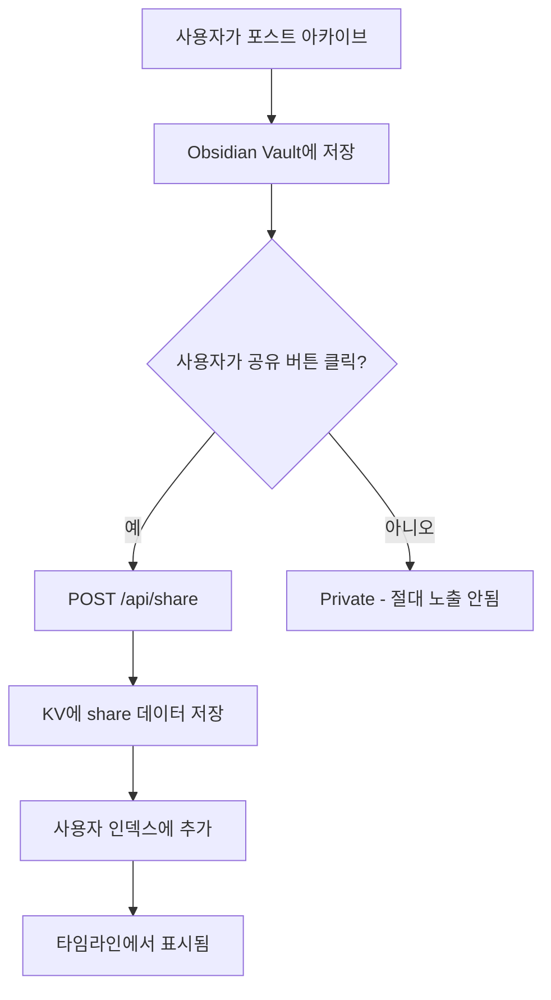

# 공유 페이지 아키텍처 개선 제안

## 📊 현재 상태 분석

### 기술 스택
- **플러그인**: TypeScript + Obsidian API (DOM 직접 조작)
- **Workers**: Cloudflare Workers + Hono
- **공유 페이지**: 인라인 HTML/CSS (템플릿 문자열)

### 현재 문제점
1. ❌ **디자인 일관성 부족** - 인라인 CSS로 관리 어려움
2. ❌ **단일 포스트만 공유** - 사용자별 타임라인 뷰 없음
3. ❌ **확장성 제한** - 템플릿 문자열로는 복잡한 UI 구현 어려움
4. ❌ **유지보수 어려움** - 플러그인과 공유 페이지 스타일 중복 관리
5. ❌ **CSS 파싱 에러** - HTML 엔티티 이스케이프 문제 (수정 완료했지만 근본적 한계)

---

## 🎯 요구사항

### 기능적 요구사항
1. ✅ **사용자 타임라인** - `/share/username` 에서 **사용자가 공유 버튼을 눌러 퍼블리시한 포스트만** 목록 표시
   - ⚠️ **중요**: 아카이브된 모든 포스트가 아니라, 명시적으로 "공유/퍼블리시" 한 포스트만
2. ✅ **개별 포스트 페이지** - `/share/username/postId` 단일 포스트
3. ✅ **반응형 디자인** - 모바일/데스크톱 모두 지원
4. ✅ **다크 테마** - Obsidian 스타일 유지
5. ✅ **SEO 최적화** - 공유 링크 미리보기 (OG tags)
6. ✅ **프라이버시 보호** - 공유하지 않은 포스트는 절대 노출되지 않음

### 기술적 요구사항
1. ✅ Cloudflare 인프라 활용 (Pages + Workers + R2 + KV)
2. ✅ 플러그인 코드와 스타일 일관성 유지
3. ✅ 빠른 로딩 속도
4. ✅ 컴포넌트 기반 아키텍처

---

## 🏗️ 추천 아키텍처: **Option 1 (최고 추천)**

### **SvelteKit + Cloudflare Pages**

#### 선택 이유
- ✅ **최고의 성능** - SSR/SSG 선택 가능, 빠른 hydration
- ✅ **Cloudflare Pages 완벽 지원** - 무료 호스팅, Worker와 동일 인프라
- ✅ **컴포넌트 기반** - 재사용 가능한 UI 구조
- ✅ **타입 안전** - TypeScript 완벽 지원
- ✅ **간단한 라우팅** - 파일 기반 라우팅
- ✅ **경량** - 번들 크기 작음 (React보다 ~40% 작음)

#### 프로젝트 구조
```
obsidian-social-archiver/
├── src/                          # Obsidian Plugin (기존 유지)
│   ├── components/
│   │   └── timeline/
│   │       └── renderers/
│   │           └── PostCardRenderer.ts   # TypeScript DOM 조작
│   └── styles.css
│
├── workers/                      # Cloudflare Workers (API)
│   └── src/
│       ├── handlers/
│       │   ├── archive.ts
│       │   ├── share.ts          # GET /api/share/:id (JSON API)
│       │   ├── user-posts.ts     # GET /api/users/:username/posts (NEW)
│       │   └── media-proxy.ts
│       └── index.ts
│
└── share-web/                    # SvelteKit App (NEW!)
    ├── src/
    │   ├── routes/
    │   │   ├── +layout.svelte               # 공통 레이아웃
    │   │   └── share/
    │   │       └── [username]/
    │   │           ├── +page.svelte         # 타임라인 (목록)
    │   │           ├── +page.ts             # 데이터 로드
    │   │           └── [postId]/
    │   │               ├── +page.svelte     # 개별 포스트
    │   │               └── +page.ts
    │   ├── lib/
    │   │   ├── components/
    │   │   │   ├── PostCard.svelte          # 포스트 카드
    │   │   │   ├── Timeline.svelte          # 타임라인 컨테이너
    │   │   │   ├── UserHeader.svelte        # 사용자 헤더
    │   │   │   └── PlatformIcon.svelte      # 플랫폼 아이콘
    │   │   ├── api/
    │   │   │   └── client.ts                # Workers API 클라이언트
    │   │   └── types/
    │   │       └── post.ts                  # 플러그인과 공유
    │   └── app.css                          # Tailwind CSS
    ├── static/
    │   └── favicon.png
    ├── tailwind.config.js
    ├── svelte.config.js
    └── wrangler.toml                        # Cloudflare Pages 설정
```

#### 라우팅 예시

**타임라인 페이지** (`/share/johndoe`)
```svelte
<!-- src/routes/share/[username]/+page.svelte -->
<script lang="ts">
  import Timeline from '$lib/components/Timeline.svelte';
  import UserHeader from '$lib/components/UserHeader.svelte';

  export let data; // { username, posts }
</script>

<UserHeader username={data.username} postCount={data.posts.length} />
<Timeline posts={data.posts} />
```

**개별 포스트 페이지** (`/share/johndoe/abc123xyz`)
```svelte
<!-- src/routes/share/[username]/[postId]/+page.svelte -->
<script lang="ts">
  import PostCard from '$lib/components/PostCard.svelte';

  export let data; // { post }
</script>

<svelte:head>
  <title>{data.post.title} - Social Archiver</title>
  <meta property="og:title" content={data.post.title} />
  <meta property="og:image" content={data.post.image} />
</svelte:head>

<PostCard post={data.post} detailed={true} />
```

**데이터 로드** (`+page.ts`)
```typescript
// src/routes/share/[username]/[postId]/+page.ts
import type { PageLoad } from './$types';

export const load: PageLoad = async ({ params, fetch }) => {
  const response = await fetch(
    `https://social-archiver-api.junlim.org/api/share/${params.postId}`
  );
  const { data } = await response.json();

  return {
    post: data
  };
};
```

---

## 🏗️ Alternative: **Option 2**

### **Astro + React/Preact**

#### 선택 이유
- ✅ **초고속 정적 사이트** - 기본적으로 0kb JavaScript
- ✅ **Islands Architecture** - 필요한 부분만 interactive
- ✅ **유연성** - React, Svelte, Vue 모두 사용 가능
- ✅ **간단한 통합** - Markdown, MDX 지원

#### 프로젝트 구조
```
share-web/
├── src/
│   ├── pages/
│   │   └── share/
│   │       └── [username]/
│   │           ├── index.astro         # 타임라인
│   │           └── [postId].astro      # 개별 포스트
│   ├── components/
│   │   ├── PostCard.tsx                # React/Preact
│   │   └── Timeline.tsx
│   └── layouts/
│       └── BaseLayout.astro
└── astro.config.mjs
```

---

## 🏗️ Alternative: **Option 3**

### **Next.js App Router**

#### 선택 이유
- ✅ **거대한 생태계** - 풍부한 라이브러리
- ✅ **다양한 렌더링 전략** - SSG, SSR, ISR
- ✅ **React 기반** - 익숙함
- ⚠️ **무거움** - 번들 크기 큼
- ⚠️ **복잡도** - 설정이 많음

---

## 🎨 UI 프레임워크 추천

### **1. Tailwind CSS + shadcn/ui (최고 추천)**

#### 이유
- ✅ **플러그인과 동일한 스타일 시스템** - Tailwind 이미 사용 중
- ✅ **복사-붙여넣기 컴포넌트** - 의존성 없음, 완전 커스터마이징
- ✅ **접근성 좋음** - Radix UI 기반
- ✅ **다크 모드 기본 지원**

```bash
npm install -D tailwindcss postcss autoprefixer
npx tailwindcss init -p
npx shadcn-svelte@latest init
```

### **2. DaisyUI**

#### 이유
- ✅ **Tailwind 플러그인** - 기존 설정에 추가만 하면 됨
- ✅ **테마 시스템** - 다크/라이트 전환 쉬움
- ✅ **빠른 프로토타입**

---

## 🗄️ 데이터 아키텍처

### 데이터 플로우 (중요!)



**핵심 원칙:**
- ✅ 아카이브 ≠ 공유 (아카이브는 로컬, 공유는 명시적 퍼블리시)
- ✅ 공유 버튼을 눌러야만 KV에 저장됨
- ✅ 타임라인은 KV의 `user_posts:{username}` 인덱스만 읽음
- ✅ 인덱스에 없는 포스트는 타임라인에 절대 표시 안됨

### KV 스키마 (추가 필요)

#### 1. 사용자별 공유 포스트 인덱스 (NEW!)
```typescript
// Key: user_posts:{username}
// Value: Array<string> (공유된 포스트 ID 목록만!)
// ⚠️ 주의: 공유 버튼을 눌렀을 때만 추가됨
{
  "username": "johndoe",
  "postIds": ["abc123", "def456", "ghi789"],  // 공유한 것만!
  "lastUpdated": "2025-10-30T10:00:00Z"
}
```

#### 2. 포스트 메타데이터 (기존)
```typescript
// Key: share:{postId}
{
  "shareId": "abc123",
  "username": "johndoe",
  "metadata": {
    "title": "...",
    "platform": "instagram",
    "author": "...",
    "originalUrl": "..."
  },
  "content": "...",
  "createdAt": "...",
  "expiresAt": "...",
  "viewCount": 42
}
```

### Workers API 엔드포인트 (추가)

```typescript
// GET /api/users/:username/posts
// 사용자의 모든 공유 포스트 목록
{
  "success": true,
  "data": {
    "username": "johndoe",
    "posts": [
      {
        "shareId": "abc123",
        "title": "...",
        "platform": "instagram",
        "createdAt": "...",
        "thumbnail": "..."
      }
    ]
  }
}
```

---

## 🚀 구현 단계

### Phase 1: 프로젝트 초기화 (1-2시간)

```bash
# 1. SvelteKit 프로젝트 생성
cd obsidian-social-archiver
npm create svelte@latest share-web
cd share-web

# 2. 의존성 설치
npm install

# 3. Tailwind CSS 추가
npx svelte-add@latest tailwindcss

# 4. shadcn-svelte 설치
npx shadcn-svelte@latest init

# 5. Cloudflare adapter 설치
npm install -D @sveltejs/adapter-cloudflare
```

**svelte.config.js 수정:**
```javascript
import adapter from '@sveltejs/adapter-cloudflare';

export default {
  kit: {
    adapter: adapter()
  }
};
```

### Phase 2: Workers API 확장 (2-3시간)

**1. 사용자 포스트 목록 API 추가**
```typescript
// workers/src/handlers/user-posts.ts
export const userPostsRouter = new Hono<Env>();

userPostsRouter.get('/:username/posts', async (c) => {
  const username = c.req.param('username');

  // KV에서 사용자 포스트 목록 가져오기
  const postIds = await c.env.SHARE_LINKS.get(
    `user_posts:${username}`,
    { type: 'json' }
  );

  // 각 포스트 메타데이터 가져오기
  const posts = await Promise.all(
    postIds.map(id => c.env.SHARE_LINKS.get(`share:${id}`, { type: 'json' }))
  );

  return c.json({
    success: true,
    data: { username, posts }
  });
});
```

**2. 공유 시 사용자 인덱스 업데이트 (핵심!)**
```typescript
// workers/src/handlers/share.ts (수정)
shareRouter.post('/', async (c) => {
  // ... 기존 share 생성 로직 ...

  // ⭐ 핵심: 공유 버튼 클릭 시에만 이 코드가 실행됨!
  // 사용자가 명시적으로 "공유/퍼블리시"를 선택한 경우만 인덱스에 추가
  const username = request.metadata.author || request.metadata.username || 'anonymous';
  const userKey = `user_posts:${username}`;

  // 기존 공유 포스트 목록 가져오기
  const existingPosts = await c.env.SHARE_LINKS.get(userKey, { type: 'json' }) || [];

  // 새 포스트 추가 (중복 방지)
  if (!existingPosts.includes(shareId)) {
    await c.env.SHARE_LINKS.put(
      userKey,
      JSON.stringify([...existingPosts, shareId])
    );

    Logger.info(c, 'Added to user timeline', { username, shareId });
  }

  return c.json({ success: true, data: shareData });
});
```

**보안 체크:**
```typescript
// 공유 해제 기능 (필요시)
shareRouter.delete('/:shareId', async (c) => {
  const shareId = c.req.param('shareId');

  // 1. share 데이터 가져오기
  const share = await c.env.SHARE_LINKS.get(`share:${shareId}`, { type: 'json' });

  // 2. 사용자 인덱스에서 제거
  const username = share.metadata.author;
  const userKey = `user_posts:${username}`;
  const posts = await c.env.SHARE_LINKS.get(userKey, { type: 'json' }) || [];

  await c.env.SHARE_LINKS.put(
    userKey,
    JSON.stringify(posts.filter(id => id !== shareId))
  );

  // 3. share 데이터 삭제
  await c.env.SHARE_LINKS.delete(`share:${shareId}`);

  return c.json({ success: true });
});
```

### Phase 3: SvelteKit 컴포넌트 구현 (4-6시간)

**1. PostCard 컴포넌트**
```svelte
<!-- src/lib/components/PostCard.svelte -->
<script lang="ts">
  import type { PostData } from '$lib/types/post';
  import PlatformIcon from './PlatformIcon.svelte';

  export let post: PostData;
  export let detailed = false;

  const getRelativeTime = (date: Date) => {
    // ... 플러그인과 동일한 로직
  };
</script>

<article class="post-card">
  <div class="platform-badge">
    <PlatformIcon platform={post.platform} />
  </div>

  <div class="content-area">
    <header>
      <strong class="author-name">{post.author.name}</strong>
      <time class="post-time">{getRelativeTime(post.metadata.timestamp)}</time>
    </header>

    <div class="content">
      {@html post.content}
    </div>

    {#if !detailed}
      <a href="/share/{post.username}/{post.shareId}" class="read-more">
        View full post →
      </a>
    {/if}
  </div>
</article>

<style>
  .post-card {
    position: relative;
    padding: 16px;
    border-radius: 8px;
    background: #202020;
    border: 1px solid #3a3a3a;
    transition: all 0.2s;
  }

  .post-card:hover {
    transform: translateY(-2px);
    box-shadow: 0 4px 12px rgba(0, 0, 0, 0.3);
    background: #252525;
  }

  /* ... 플러그인과 동일한 스타일 ... */
</style>
```

**2. Timeline 컴포넌트**
```svelte
<!-- src/lib/components/Timeline.svelte -->
<script lang="ts">
  import PostCard from './PostCard.svelte';
  import type { PostData } from '$lib/types/post';

  export let posts: PostData[];
</script>

<div class="timeline-container">
  {#each posts as post (post.shareId)}
    <PostCard {post} />
  {/each}
</div>

<style>
  .timeline-container {
    max-width: 680px;
    margin: 0 auto;
    display: flex;
    flex-direction: column;
    gap: 16px;
  }
</style>
```

### Phase 4: Cloudflare Pages 배포 (30분)

```bash
# 1. 빌드
npm run build

# 2. Cloudflare Pages 프로젝트 생성
npx wrangler pages project create social-archiver-share

# 3. 배포
npx wrangler pages deploy build
```

**또는 GitHub Actions 자동 배포:**
```yaml
# .github/workflows/deploy-share-web.yml
name: Deploy Share Web
on:
  push:
    branches: [main]
    paths: ['share-web/**']

jobs:
  deploy:
    runs-on: ubuntu-latest
    steps:
      - uses: actions/checkout@v3
      - uses: actions/setup-node@v3
      - run: npm install
        working-directory: share-web
      - run: npm run build
        working-directory: share-web
      - uses: cloudflare/pages-action@v1
        with:
          apiToken: ${{ secrets.CLOUDFLARE_API_TOKEN }}
          accountId: ${{ secrets.CLOUDFLARE_ACCOUNT_ID }}
          projectName: social-archiver-share
          directory: share-web/build
```

---

## 💰 비용 분석

### Cloudflare Pages (무료)
- ✅ 500 빌드/월
- ✅ 무제한 대역폭
- ✅ 무제한 요청

### Cloudflare Workers (무료 티어)
- ✅ 100,000 요청/일
- ✅ 10ms CPU 시간/요청

### Cloudflare R2 (무료 티어)
- ✅ 10GB 저장 공간
- ✅ 1백만 Class B 작업/월

**총 예상 비용: $0/월** (무료 티어 내)

---

## 📊 성능 비교

| 항목 | 현재 (인라인 HTML) | SvelteKit | Next.js | Astro |
|------|-------------------|-----------|---------|-------|
| 초기 로딩 | ⚠️ 느림 | ✅ 빠름 | ⚠️ 보통 | ✅ 매우 빠름 |
| TTI (Time to Interactive) | ⚠️ 즉시 (단순) | ✅ 빠름 | ⚠️ 느림 | ✅ 매우 빠름 |
| 번들 크기 | ✅ 0kb | ✅ ~50kb | ❌ ~150kb | ✅ ~0kb |
| 개발 경험 | ❌ 나쁨 | ✅ 좋음 | ✅ 좋음 | ✅ 좋음 |
| 유지보수성 | ❌ 어려움 | ✅ 쉬움 | ✅ 쉬움 | ✅ 쉬움 |

---

## ✅ 최종 권장사항

### **SvelteKit + Tailwind CSS + shadcn-svelte**

**이유:**
1. ⚡ **최고의 성능** - 작은 번들, 빠른 hydration
2. 🎨 **일관된 스타일** - 플러그인과 동일한 Tailwind 사용
3. 💰 **무료 호스팅** - Cloudflare Pages
4. 🔧 **쉬운 유지보수** - 컴포넌트 기반 구조
5. 📈 **확장 가능** - 사용자 타임라인, 검색, 필터 등 쉽게 추가

### 예상 소요 시간
- Phase 1: 프로젝트 초기화 (1-2시간)
- Phase 2: Workers API 확장 (2-3시간)
- Phase 3: SvelteKit 컴포넌트 (4-6시간)
- Phase 4: 배포 설정 (30분)

**총: 8-12시간** (1-2일)

---

## 🔗 URL 구조 및 프라이버시

### 제안하는 URL 구조
```
/share/username           → 사용자 타임라인 (공유한 포스트만!)
/share/username/postId    → 개별 포스트 상세

예시:
/share/johndoe            → John Doe가 공유 버튼을 눌러서 퍼블리시한 포스트 목록
/share/johndoe/abc123     → 특정 포스트 상세 페이지
```

### 프라이버시 보장
- ❌ `/share/johndoe`는 아카이브된 모든 포스트를 보여주지 않음
- ✅ 오직 공유 버튼으로 명시적으로 퍼블리시한 포스트만 표시
- ✅ 공유하지 않은 포스트는 타임라인에 절대 노출 안됨
- ✅ 직접 URL을 알아도 `/share/username/privateId`는 404 (KV에 없으면 접근 불가)
- ✅ 공유 해제 시 타임라인과 개별 페이지 모두에서 즉시 삭제

---

## 📝 다음 단계

1. ✅ **이 문서 검토 및 승인**
2. ⏳ SvelteKit 프로젝트 생성
3. ⏳ Workers API 사용자 인덱스 구현
4. ⏳ PostCard 컴포넌트 마이그레이션
5. ⏳ 타임라인 페이지 구현
6. ⏳ Cloudflare Pages 배포
7. ⏳ 플러그인에서 사용자 이름 수집 (공유 시)

---

## 🤔 대안: 점진적 마이그레이션

만약 전체 마이그레이션이 부담스럽다면:

### **단계적 접근**
1. **Phase 1**: 현재 Worker에 CSS 프레임워크 추가 (Tailwind CDN → 빌드 통합)
2. **Phase 2**: 템플릿을 별도 파일로 분리
3. **Phase 3**: 사용자 타임라인 API 추가
4. **Phase 4**: SvelteKit으로 완전 마이그레이션

하지만 **전체 마이그레이션을 강력히 추천**합니다. 현재 아키텍처의 한계가 명확하고, 근본적인 개선이 필요합니다.
