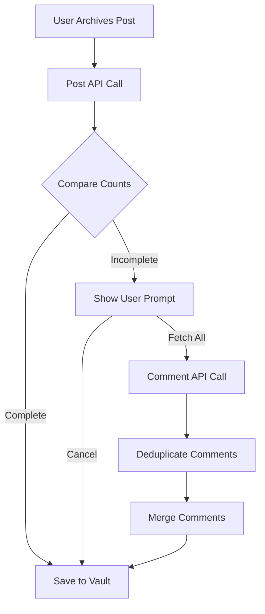

# Comment Fetching Feature

## Overview

Social media platforms (especially Instagram) often provide limited comments in their initial API response. This feature allows users to fetch all comments for a post when needed, with user consent for additional credit usage.

## Problem Statement

### Current Limitation
- **Initial Fetch**: Post API returns ~20-50 comments
- **Actual Count**: Post metadata shows total comment count (e.g., 150 comments)
- **Gap**: Users don't get all comments without additional API call

### Example Scenario
```
Post URL: https://www.instagram.com/p/ABC123/
Initial Response:
  - metadata.comments: 150
  - comments.length: 20

Missing: 130 comments (87% of total)
```

## Solution: Two-Stage Comment Fetching

### Workflow



### Stage 1: Initial Archive (1 Credit)

**API Call**: Post Dataset
- **Endpoint**: `/api/archive`
- **Credits**: 1
- **Response**:
  - Post metadata (likes, shares, comment count)
  - Limited comments (~20-50)
  - Media files

### Stage 2: Additional Comments (1 Credit, Optional)

**Trigger Condition**:
```typescript
if (metadata.comment_count > comments.length && metadata.comment_count > 20) {
  // Prompt user for additional fetch
}
```

**API Call**: Comment Dataset
- **Endpoint**: `/api/comments`
- **Credits**: 1 (only if user confirms)
- **Response**: All comments for the post

## API Specification

### 1. Comment Endpoint

#### Request
```typescript
POST /api/comments

{
  "url": "https://www.instagram.com/p/ABC123/",
  "licenseKey": "optional-license-key"
}
```

#### Response
```typescript
{
  "success": true,
  "data": {
    "jobId": "job_xyz789",
    "status": "pending",
    "estimatedTime": 30,
    "creditsRequired": 1
  }
}
```

#### Job Result
```typescript
GET /api/comments/:jobId

{
  "success": true,
  "data": {
    "jobId": "job_xyz789",
    "status": "completed",
    "result": {
      "comments": [
        {
          "id": "18050089526322689",
          "author": {
            "name": "username",
            "url": "https://www.instagram.com/username"
          },
          "content": "Great post!",
          "timestamp": "2025-10-07T04:02:07Z",
          "likes": 5,
          "replies": []
        }
      ],
      "creditsUsed": 1
    }
  }
}
```

### 2. BrightData Integration

#### Dataset IDs
```typescript
const COMMENT_DATASET_IDS = {
  instagram: 'gd_ltppn085pokosxh13', // Instagram Comments
  // Future: Add other platforms as needed
};
```

#### Request Format
```javascript
const data = JSON.stringify([
  {
    "url": "https://www.instagram.com/p/ABC123/"
  }
]);

const options = {
  hostname: "api.brightdata.com",
  path: "/datasets/v3/trigger?dataset_id=gd_ltppn085pokosxh13&include_errors=true",
  method: "POST",
  headers: {
    "Authorization": "Bearer YOUR_API_KEY",
    "Content-Type": "application/json",
  },
};
```

#### Response Format
```json
[
  {
    "url": "https://www.instagram.com/username",
    "comment_user": "commenter_username",
    "comment_user_url": "https://www.instagram.com/commenter",
    "comment_date": "Tue Oct 07 2025 04:02:07 GMT+0000",
    "comment": "Great post!",
    "likes_number": 5,
    "replies_number": 2,
    "replies": null,
    "hashtag_comment": null,
    "tagged_users_in_comment": null,
    "post_url": "https://www.instagram.com/p/ABC123/",
    "post_user": "post_owner",
    "comment_id": "18050089526322689",
    "post_id": "3737716731055011904_1928009576"
  }
]
```

## User Experience

### Prompt Dialog

**Condition**: When `comment_count > fetched_comments.length`

**Dialog**:
```
This post has 150 comments but only 20 were fetched.

Fetch all 150 comments?
(This will use 1 additional credit)

[Cancel]  [Fetch All Comments]
```

### User Options

#### Option 1: Cancel (Default)
- **Action**: Proceed with limited comments
- **Credits Used**: 1 (initial post only)
- **Result**: Post saved with 20 comments

#### Option 2: Fetch All Comments
- **Action**: Trigger comment API call
- **Credits Used**: 2 (post + comments)
- **Result**: Post saved with all 150 comments

### Progress Indication

```
Archiving post... ✓
Post has 150 comments (20 fetched)
[User confirms additional fetch]
Fetching all comments... ⏳
Deduplicating comments... ✓
Merging 130 new comments... ✓
Saving to vault... ✓

✅ Archived successfully! Credits used: 2
```

## Implementation Details

### 1. Comment Deduplication

**Purpose**: Remove duplicate comments from merged result

**Logic**:
```typescript
function deduplicateComments(
  existing: Comment[],
  additional: Comment[]
): Comment[] {
  const seen = new Set<string>();
  const merged: Comment[] = [];

  // Add existing comments
  for (const comment of existing) {
    const key = getCommentKey(comment);
    seen.add(key);
    merged.push(comment);
  }

  // Add new comments (skip duplicates)
  for (const comment of additional) {
    const key = getCommentKey(comment);
    if (!seen.has(key)) {
      seen.add(key);
      merged.push(comment);
    }
  }

  return merged;
}

function getCommentKey(comment: Comment): string {
  // Use comment_id if available (most reliable)
  if (comment.id) {
    return `id:${comment.id}`;
  }

  // Fallback: composite key
  return `${comment.author.name}:${comment.content}:${comment.timestamp}`;
}
```

### 2. Comment Merging

**Strategy**: Preserve original order, append new comments

```typescript
function mergeComments(
  original: Comment[],
  additional: Comment[]
): Comment[] {
  const deduplicated = deduplicateComments(original, additional);

  // Sort by timestamp (oldest first)
  return deduplicated.sort((a, b) => {
    const timeA = new Date(a.timestamp).getTime();
    const timeB = new Date(b.timestamp).getTime();
    return timeA - timeB;
  });
}
```

### 3. Plugin Integration

**File**: `src/main.ts`

```typescript
async archivePost(url: string, options?: ArchiveOptions): Promise<void> {
  // Stage 1: Archive post
  const result = await this.apiClient.submitArchive(url, options);
  await this.apiClient.waitForJob(result.jobId);

  // Stage 2: Check if additional comments needed
  const postData = result.postData;
  const commentCount = postData.metadata.comments || 0;
  const fetchedCount = postData.comments?.length || 0;

  if (commentCount > fetchedCount && commentCount > 20) {
    const shouldFetch = confirm(
      `This post has ${commentCount} comments but only ${fetchedCount} were fetched.\n\n` +
      `Fetch all ${commentCount} comments?\n` +
      `(This will use 1 additional credit)`
    );

    if (shouldFetch) {
      // Fetch additional comments
      const commentResult = await this.apiClient.submitComments(url);
      const commentJob = await this.apiClient.waitForJob(commentResult.jobId);

      // Merge comments
      const additionalComments = commentJob.result.comments;
      postData.comments = this.mergeComments(
        postData.comments || [],
        additionalComments
      );

      new Notice(`Fetched ${additionalComments.length} additional comments`);
    }
  }

  // Save to vault
  await this.saveToVault(postData);
}
```

## Credit Usage

### Scenarios

| Scenario | Post API | Comment API | Total Credits |
|----------|----------|-------------|---------------|
| Post without comments | 1 | 0 | 1 |
| Post with complete comments (<20) | 1 | 0 | 1 |
| Post with partial comments (user cancels) | 1 | 0 | 1 |
| Post with partial comments (user fetches all) | 1 | 1 | 2 |

### Credit Calculation

```typescript
function calculateCredits(options: ArchiveOptions): number {
  let credits = 1; // Base: Post API

  if (options.fetchAllComments) {
    credits += 1; // Additional: Comment API
  }

  if (options.enableAI) {
    credits += 2; // AI analysis
  }

  if (options.deepResearch) {
    credits += 2; // Deep research
  }

  return credits;
}
```

## Platform Support

### Current Support
- ✅ **Instagram**: Fully supported with dedicated comment dataset

### Future Support
- ⏳ **Facebook**: Planned (requires comment dataset ID)
- ⏳ **LinkedIn**: Planned (requires comment dataset ID)
- ⏳ **X (Twitter)**: Planned (requires comment dataset ID)
- ⏳ **TikTok**: Planned (requires comment dataset ID)
- ⏳ **Threads**: Planned (requires comment dataset ID)

### Platform Detection

```typescript
function supportsCommentFetching(platform: string): boolean {
  return platform === 'instagram'; // Expand as more platforms added
}
```

## Error Handling

### Scenarios

#### 1. Comment API Failure
```typescript
try {
  const comments = await fetchAllComments(url);
} catch (error) {
  console.error('Failed to fetch comments:', error);
  new Notice('⚠️ Failed to fetch additional comments. Using partial comments.');
  // Continue with partial comments
}
```

#### 2. Insufficient Credits
```typescript
if (creditsRemaining < 2) {
  new Notice(
    '⚠️ Not enough credits to fetch all comments.\n' +
    `Required: 2 credits, Available: ${creditsRemaining}`
  );
  return; // Don't prompt user
}
```

#### 3. Timeout
```typescript
const timeout = 120000; // 2 minutes
const result = await Promise.race([
  fetchAllComments(url),
  new Promise((_, reject) =>
    setTimeout(() => reject(new Error('Timeout')), timeout)
  )
]);
```

## Testing

### Test Cases

#### 1. Normal Flow
```typescript
// Given: Post with 150 comments, only 20 fetched
// When: User confirms additional fetch
// Then: All 150 comments saved
```

#### 2. User Cancels
```typescript
// Given: Post with 150 comments, only 20 fetched
// When: User cancels additional fetch
// Then: Only 20 comments saved, 1 credit used
```

#### 3. Deduplication
```typescript
// Given: Original comments [1,2,3], Additional comments [2,3,4,5]
// When: Merge comments
// Then: Result [1,2,3,4,5] (no duplicates)
```

#### 4. Platform Not Supported
```typescript
// Given: Facebook post (comment dataset not configured)
// When: Archive post
// Then: No prompt shown, proceed with partial comments
```

## Future Enhancements

### 1. Automatic Fetching Option
```typescript
// Plugin setting
settings.autoFetchAllComments = true; // Always fetch without prompting
```

### 2. Comment Threshold
```typescript
// Only prompt if comment count exceeds threshold
if (commentCount > settings.commentFetchThreshold) {
  // Prompt user
}
```

### 3. Background Fetching
```typescript
// Fetch comments in background after saving post
await savePostToVault(postData);
new Notice('Post saved! Fetching additional comments in background...');

// Non-blocking comment fetch
fetchAllCommentsAsync(url).then(comments => {
  updatePostWithComments(filePath, comments);
});
```

### 4. Partial Fetching
```typescript
// Fetch in batches (e.g., 50 at a time)
const batchSize = 50;
const batches = Math.ceil((commentCount - fetchedCount) / batchSize);
```

## References

- [BrightData Instagram Comments Dataset](https://brightdata.com/products/datasets/instagram-comments)
- [Instagram API Documentation](https://developers.facebook.com/docs/instagram-api)
- [Obsidian Plugin API](https://docs.obsidian.md/Plugins/Getting+started/Build+a+plugin)

## Change Log

### Version 1.0.3 (Planned)
- Initial implementation of comment fetching
- Instagram support only
- User confirmation dialog
- Comment deduplication
- Credit tracking

### Future Versions
- Multi-platform support
- Auto-fetch setting
- Background fetching
- Batch fetching
