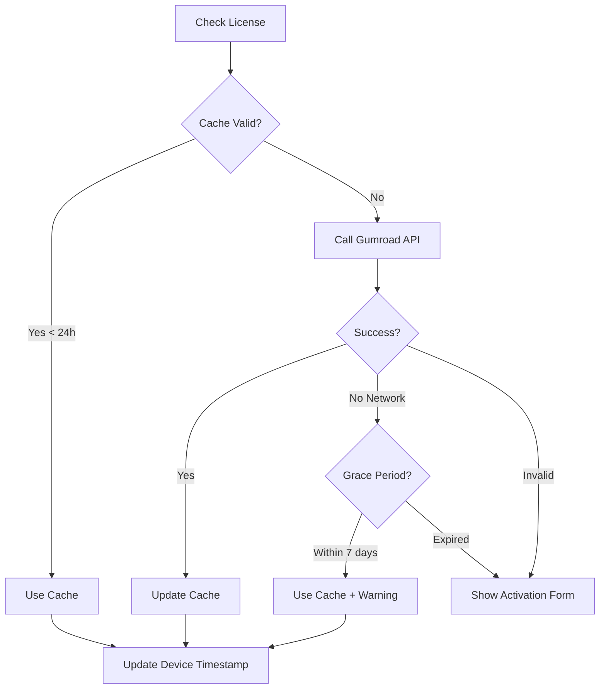

# Licensing System Design

## Overview
Credit-based licensing system with Gumroad integration for Obsidian Social Archiver plugin.

**Reference Implementation:** korean-grammar-svelte & korean-grammar-server

## Tiers & Credits

### Free Tier
- **10 credits/month**
- No rollover
- Basic features

### Pro Tier
- **500 credits/month**
- Up to 100 credits rollover
- All features unlocked

### Credit Costs
```typescript
const CREDIT_COSTS = {
  basic_archive: 1,      // Simple post archiving
  with_ai: 3,            // AI-enhanced archiving
  deep_research: 5       // Deep research with Perplexity
} as const;
```

## Architecture

### 1. Type System

#### Core Types
```typescript
// License Management
interface LicenseInfo {
  licenseKey: string;
  provider: 'gumroad' | 'manual';
  productId: string;
  productName: string;
  email?: string;
  purchaseDate: Date;
  expiresAt?: Date;
  devices: DeviceInfo[];
  maxDevices: number;
  isActive: boolean;
  lastValidatedAt: Date;
}

interface DeviceInfo {
  deviceId: string;
  deviceName: string;
  platform: 'darwin' | 'win32' | 'linux';
  activatedAt: Date;
  lastActiveAt: Date;
  isCurrentDevice: boolean;
}

// Credit Management
interface CreditBalance {
  total: number;
  used: number;
  remaining: number;
  resetAt: Date;
  carryover: number;
}

interface CreditTransaction {
  id: string;
  timestamp: Date;
  operation: 'basic_archive' | 'with_ai' | 'deep_research';
  creditsUsed: number;
  remainingBalance: number;
  postUrl: string;
  platform: string;
}

// Subscription
interface SubscriptionStatus {
  tier: 'free' | 'pro';
  isActive: boolean;
  credits: CreditBalance;
  expiresAt?: Date;
  lastResetAt: Date;
  nextResetAt: Date;
}
```

### 2. Gumroad API Integration

#### API Configuration
- **Endpoint:** `https://api.gumroad.com/v2/licenses/verify`
- **Method:** POST
- **Headers:** `Content-Type: application/x-www-form-urlencoded`
- **Body:** `product_id`, `license_key`, `increment_uses_count`

#### Caching Strategy
- Cache valid licenses for **24 hours**
- Use Obsidian's `loadData/saveData` API (no Redis)
- On network error: Use cached data within grace period

#### Grace Period
- **7 days** offline validation grace period
- After 7 days: Show warning but allow basic operations
- Display "reconnect to verify" notice

### 3. Device Management

#### Device Limits
- **5 devices maximum** per license (all tiers)
- Client-side device tracking
- UUID v4 for device identification

#### Device Activation Flow
```typescript
1. Generate deviceId (UUID v4) on first run
2. Check current device count
3. If under limit → Activate device
4. If at limit → Show device management UI
5. Store device info locally
6. Update lastActiveAt on each validation
```

### 4. Credit Management

#### Monthly Reset Logic
```typescript
// Reset based on activation date
const resetDay = activationDate.getDate();
const nextReset = new Date(
  now.getFullYear(),
  now.getMonth() + 1,
  Math.min(resetDay, getLastDayOfMonth())
);
```

#### Credit Operations
```typescript
class CreditManager {
  // Check if operation is affordable
  canAfford(cost: number): boolean;

  // Reserve credits before operation
  reserveCredits(cost: number): Promise<void>;

  // Commit credits after success
  commitCredits(cost: number, metadata: object): Promise<void>;

  // Rollback on failure
  rollbackCredits(cost: number): Promise<void>;

  // Monthly reset with rollover
  resetMonthlyCredits(): Promise<void>;

  // Get transaction history
  getTransactions(limit: number): CreditTransaction[];
}
```

#### Transaction Flow
```typescript
async archivePost(url: string, options: ArchiveOptions) {
  // 1. Calculate cost
  const cost = calculateCreditCost(options);

  // 2. Check balance
  if (!creditManager.canAfford(cost)) {
    throw new InsufficientCreditsError();
  }

  // 3. Reserve credits
  await creditManager.reserveCredits(cost);

  try {
    // 4. Perform operation
    const result = await brightDataClient.scrape(url, options);

    // 5. Commit credits
    await creditManager.commitCredits(cost, { url, platform });

    return result;
  } catch (error) {
    // 6. Rollback on failure
    await creditManager.rollbackCredits(cost);
    throw error;
  }
}
```

### 5. Storage Architecture

#### Plugin Data Structure
```typescript
interface PluginData {
  license: {
    key: string;           // Encrypted with AES-256-GCM
    info: LicenseInfo;
    lastValidated: Date;
    deviceId: string;
  };
  credits: {
    balance: CreditBalance;
    transactions: CreditTransaction[]; // Last 100
    lastReset: Date;
    nextReset: Date;
  };
  subscription: SubscriptionStatus;
}
```

#### Encryption
- **Algorithm:** AES-256-GCM
- **Key Derivation:** PBKDF2 from vault path + device ID
- **Encrypted Fields:** License key only
- **Implementation:** Web Crypto API

### 6. Validation Flow



### 7. Error Handling

#### Error Types
```typescript
type LicenseErrorType =
  | 'network_error'         // Use cached + grace period
  | 'invalid_license'       // Clear stored + show activation
  | 'expired_license'       // Show renewal prompt
  | 'device_limit_exceeded' // Show device management
  | 'rate_limited'          // Show retry timer
  | 'validation_failed';    // Generic validation error

interface LicenseError {
  type: LicenseErrorType;
  message: string;
  retryable: boolean;
  retryAfter?: number;
}
```

## UI Components (Svelte 5)

### Components to Build

1. **LicenseActivationModal.svelte**
   - License key input form
   - Validation feedback
   - Device info display

2. **CreditBalanceDisplay.svelte**
   - Current balance progress bar
   - Next reset countdown
   - Quick stats

3. **SubscriptionSettings.svelte**
   - License info display
   - Device management
   - Usage history
   - Upgrade button

4. **UpgradePrompt.svelte**
   - Show when credits low (< 20%)
   - Show when exhausted
   - Link to Gumroad

5. **UsageHistoryTable.svelte**
   - Transaction log
   - Filter by date/operation
   - Export capability

### Mobile-First Design Principles
- 44px minimum touch targets
- Responsive breakpoints
- Touch-friendly interactions
- Accessible keyboard navigation

## Integration with BrightData

### Pre-Operation Check
```typescript
// Before each archive operation
async beforeArchive(options: ArchiveOptions) {
  const cost = calculateCreditCost(options);

  if (!creditManager.canAfford(cost)) {
    // Show upgrade prompt
    new UpgradePrompt(this.app).open();
    throw new InsufficientCreditsError();
  }

  // Reserve credits
  await creditManager.reserveCredits(cost);
}
```

### Post-Operation Logging
```typescript
// After successful archive
async afterArchive(result: ArchiveResult, cost: number) {
  await creditManager.commitCredits(cost, {
    postUrl: result.url,
    platform: result.platform,
    timestamp: new Date(),
  });

  // Show balance update notification
  new Notice(`Archive complete! ${creditManager.getRemaining()} credits remaining`);
}
```

## Security Considerations

1. **License Key Storage**
   - Encrypt at rest with AES-256-GCM
   - Never log license keys
   - Clear on logout/deactivation

2. **API Communication**
   - HTTPS only
   - Validate response format
   - Rate limit requests (max 1/hour unless forced)

3. **Device Tracking**
   - Client-side honor system
   - Server validates on activation
   - Don't expose device IDs in logs

4. **Credit Operations**
   - Atomic transactions (reserve → commit/rollback)
   - Validate on both client and server
   - Log all credit changes

## Testing Strategy

### Unit Tests
- Credit calculation logic
- License validation
- Device management
- Encryption/decryption

### Integration Tests
- Gumroad API mocking
- Cache behavior
- Grace period handling
- Error scenarios

### E2E Tests
- Complete activation flow
- Archive operation with credit deduction
- Monthly reset
- Device limit scenarios

## Deployment Checklist

- [ ] Set up Gumroad product
- [ ] Configure product ID in settings
- [ ] Test license generation
- [ ] Test device activation
- [ ] Verify credit deduction
- [ ] Test monthly reset
- [ ] Test offline grace period
- [ ] Mobile UI testing
- [ ] Security audit
- [ ] Documentation update

## Future Enhancements

1. **Team Licenses**
   - Shared credit pool
   - Admin dashboard
   - Usage analytics per user

2. **Promotional Codes**
   - Discount validation
   - Bonus credits
   - Extended trials

3. **Webhook Integration**
   - Real-time license updates
   - Automatic renewals
   - Refund handling

4. **Usage Analytics**
   - Credit usage trends
   - Popular operations
   - Cost optimization suggestions
