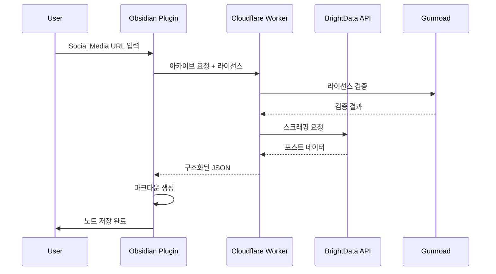
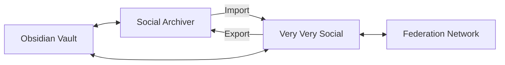

# Social Archiver for Obsidian - 프로젝트 기획서

## 📋 목차
1. [프로젝트 개요](#프로젝트-개요)
2. [기술 아키텍처](#기술-아키텍처)
3. [아키텍처 패턴](#아키텍처-패턴)
4. [비즈니스 모델](#비즈니스-모델)
5. [구현 계획](#구현-계획)
6. [기능 명세](#기능-명세)
7. [사용자 경험](#사용자-경험)
8. [보안 및 프라이버시](#보안-및-프라이버시)
9. [마케팅 전략](#마케팅-전략)
10. [개발 가이드](#개발-가이드)
11. [리스크 관리](#리스크-관리)

---

## 프로젝트 개요

### 🎯 미션
소셜 미디어 포스트(Facebook, LinkedIn, Instagram, TikTok, X.com, Threads)를 Obsidian 노트로 원클릭 아카이빙하여 사용자가 자신의 데이터를 완전히 소유할 수 있도록 한다.

### 💡 핵심 가치 제안
- **30초 설치**: 복잡한 서버 설정 없이 즉시 사용
- **완전한 소유권**: 모든 데이터가 로컬 Vault에 저장
- **원클릭 아카이빙**: URL 입력만으로 자동 처리
- **영구 보관**: 플랫폼이 삭제해도 안전하게 보관
- **멀티 플랫폼**: Facebook, LinkedIn, Instagram, TikTok, X.com, Threads 지원

### 👥 타겟 사용자
- **Primary**: Obsidian 활성 사용자 (약 1M+)
- **Secondary**: 
  - 디지털 아카이빙에 관심있는 연구자
  - 소셜 미디어 마케터
  - 저널리스트 및 콘텐츠 크리에이터
  - PKM(Personal Knowledge Management) 실천자

### 🎨 제품 원칙
1. **Simple**: 기술적 지식 없이도 사용 가능
2. **Secure**: 사용자 데이터는 로컬에만 저장
3. **Scalable**: 1명이든 10만명이든 동일한 성능
4. **Sustainable**: 예측 가능한 비용 구조

---

## 기술 아키텍처

### 🏗️ 시스템 구성

```
┌─────────────────────────────────────────────┐
│                 사용자 환경                   │
│                                              │
│  ┌──────────────────┐  ┌─────────────────┐  │
│  │ Obsidian Plugin  │  │  Local Vault    │  │
│  │  (Svelte 5 +     │  │   (.md files)   │  │
│  │   TypeScript 5.7)│  │                 │  │
│  └────────┬─────────┘  └─────────────────┘  │
└───────────┼──────────────────────────────────┘
            │ HTTPS
            ▼
┌──────────────────────────────────────────────┐
│         Cloudflare Workers (Edge)            │
│                                              │
│  ┌─────────────┐  ┌──────────────────────┐  │
│  │  API Router │  │  License Manager     │  │
│  └──────┬──────┘  └──────────┬───────────┘  │
│         │                     │              │
│  ┌──────▼──────┐  ┌──────────▼───────────┐  │
│  │   KV Store  │  │   Rate Limiter       │  │
│  └─────────────┘  └──────────────────────┘  │
└──────────┬───────────────────────────────────┘
           │
           ▼
┌──────────────────────────────────────────────┐
│           External Services                  │
│                                              │
│  ┌─────────────┐  ┌──────────────────────┐  │
│  │  BrightData │  │     Gumroad API      │  │
│  │  Scraping   │  │   (License Verify)   │  │
│  └─────────────┘  └──────────────────────┘  │
└──────────────────────────────────────────────┘
```

### 🔧 기술 스택

| 레이어 | 기술 | 선택 이유 |
|--------|------|-----------|
| **Frontend Plugin** | Obsidian Plugin (Svelte 5 + TypeScript 5.9) | Signals 기반 반응성, 컴파일 최적화, 최신 타입 시스템 |
| **UI Framework** | Svelte 5 (Runes) | Push-Pull 반응성, 세밀한 업데이트, $state/$derived/$effect |
| **Type System** | TypeScript 5.9+ | ECMAScript 2025 지원, 표준 데코레이터, Awaited 타입 개선 |
| **Styling** | Tailwind CSS 4.0 | Oxide 엔진 (Rust), 5배 빠른 빌드, oklch 색상 공간 |
| **Build Tool** | Vite 5+ | esbuild + Rollup, HMR, Svelte 통합 |
| **Backend** | Cloudflare Workers | 서버리스, 글로벌 엣지, 무료 티어 |
| **Database** | Cloudflare KV | 키-값 저장소, Workers와 통합, 공유 링크 임시 저장 |
| **Scraping** | BrightData API | 멀티 플랫폼 지원, 합법적, 안정적 |
| **Payment** | Gumroad | 간단한 디지털 상품 판매 |
| **Monitoring** | Cloudflare Analytics | 내장 분석 도구 |

### 🔄 데이터 플로우



### 🔑 API 엔드포인트

```yaml
BASE_URL: https://api.social-archiver.app

Endpoints:
  # 핵심 기능 (Async/Sync 모드)
  POST /archive?mode=sync|async
    body: { url: string, licenseKey: string, aiOptions?: AIOptions }
    response(sync): { data: PostData, remaining: number }
    response(async): { jobId: string }
  
  # Job 상태 확인
  GET /jobs/{jobId}
    response: { 
      status: 'queued'|'running'|'failed'|'completed',
      data?: PostData,
      error?: ApiError 
    }
  
  # 라이선스 관리
  POST /verify
    body: { licenseKey: string }
    response: { valid: boolean, credits: number }
  
  GET /balance
    headers: { Authorization: "Bearer {licenseKey}" }
    response: { credits: number, type: string }
  
  # 공유 시스템
  POST /share/create
    body: { data: TimelineData, ttl?: number }
    response: { viewId: string, url: string, expiresAt: Date }
  
  POST /share/delete/{viewId}
    body: { reason?: string }
    response: { success: boolean }
  
  GET /view/{viewId}
    response: HTML (동적 렌더링, XSS 보호)
    headers: { X-Robots-Tag: noindex }
  
  # 웹훅
  POST /webhook/gumroad
    body: { sale_id, product_id, email, ... }
    response: { success: boolean }
    validation: HMAC signature verification
```

---

## 아키텍처 패턴

### 🎯 SRP (Single Responsibility Principle)

#### 컴포넌트 설계 원칙
```typescript
// ❌ Bad: 여러 책임을 가진 컴포넌트
class SocialArchiver {
  // API 호출, UI 렌더링, 데이터 검증, 파일 저장 모두 처리
}

// ✅ Good: 단일 책임 원칙
class ArchiveService {  // API 통신만 담당
  async fetchPost(url: string) { /* ... */ }
}

class MarkdownConverter {  // 마크다운 변환만 담당
  convert(data: PostData): string { /* ... */ }
}

class VaultManager {  // Vault 작업만 담당
  async saveNote(content: string) { /* ... */ }
}

class LicenseValidator {  // 라이선스 검증만 담당
  validate(key: string): boolean { /* ... */ }
}
```

#### 서비스 레이어 분리
```typescript
// services/platforms/facebook.service.ts
export class FacebookService implements PlatformService {
  private readonly urlPattern = /facebook\.com\/(posts|watch|share)/;
  
  validateUrl(url: string): boolean {
    return this.urlPattern.test(url);
  }
  
  extractPostId(url: string): string {
    // Facebook 특화 로직만
  }
}

// services/archive.orchestrator.ts
export class ArchiveOrchestrator {
  constructor(
    private platforms: Map<Platform, PlatformService>,
    private api: ApiService,
    private converter: MarkdownConverter,
    private vault: VaultManager
  ) {}
  
  async archive(url: string): Promise<void> {
    // 오케스트레이션만 담당
    const platform = this.detectPlatform(url);
    const data = await this.api.fetch(url, platform);
    const markdown = this.converter.convert(data);
    await this.vault.save(markdown);
  }
}
```

### 🪝 공통 훅 시스템 (Composables)

#### Svelte 5 커스텀 훅 패턴
```typescript
// hooks/useArchiveState.ts
import { type Writable } from 'svelte/store';

export function useArchiveState() {
  let isArchiving = $state(false);
  let error = $state<Error | null>(null);
  let progress = $state(0);
  
  const startArchiving = () => {
    isArchiving = true;
    error = null;
    progress = 0;
  };
  
  const updateProgress = (value: number) => {
    progress = value;
  };
  
  const completeArchiving = () => {
    isArchiving = false;
    progress = 100;
  };
  
  const failArchiving = (err: Error) => {
    isArchiving = false;
    error = err;
  };
  
  return {
    get isArchiving() { return isArchiving; },
    get error() { return error; },
    get progress() { return progress; },
    startArchiving,
    updateProgress,
    completeArchiving,
    failArchiving
  };
}

// hooks/useLicense.ts
export function useLicense() {
  let credits = $state(0);
  let licenseType = $state<'trial' | 'credits' | 'unlimited' | null>(null);
  let isValid = $state(false);
  
  const checkLicense = $derived(() => {
    return isValid && (licenseType === 'unlimited' || credits > 0);
  });
  
  $effect(() => {
    // 라이선스 상태 변경 감지
    if (credits === 0 && licenseType === 'credits') {
      console.warn('Credits exhausted');
    }
  });
  
  return {
    get credits() { return credits; },
    get licenseType() { return licenseType; },
    get canArchive() { return checkLicense; },
    setLicense: (type: typeof licenseType, count?: number) => {
      licenseType = type;
      if (count !== undefined) credits = count;
      isValid = true;
    },
    consumeCredit: () => {
      if (credits > 0) credits--;
    }
  };
}

// hooks/usePlatformDetection.ts
export function usePlatformDetection() {
  const platforms = {
    facebook: /facebook\.com\/(posts|watch|share)/,
    linkedin: /linkedin\.com\/(posts|feed|pulse)/,
    instagram: /instagram\.com\/(p|reel|tv)/,
    tiktok: /tiktok\.com\/(video|@)/,
    x: /x\.com\/(status|i\/spaces)/,
    threads: /threads\.net\/(t|@.*\/post)/
  };
  
  let detectedPlatform = $state<keyof typeof platforms | null>(null);
  let isValidUrl = $state(false);
  
  const detectPlatform = (url: string) => {
    for (const [platform, pattern] of Object.entries(platforms)) {
      if (pattern.test(url)) {
        detectedPlatform = platform as keyof typeof platforms;
        isValidUrl = true;
        return;
      }
    }
    detectedPlatform = null;
    isValidUrl = false;
  };
  
  return {
    get platform() { return detectedPlatform; },
    get isValid() { return isValidUrl; },
    detectPlatform,
    patterns: platforms
  };
}
```

#### 라이프사이클 훅 활용
```typescript
// hooks/useAutoSave.ts
import { onMount, onDestroy, tick } from 'svelte';

export function useAutoSave(saveFunction: () => Promise<void>, interval = 30000) {
  let timer: NodeJS.Timeout;
  let lastSaved = $state(new Date());
  
  onMount(() => {
    timer = setInterval(async () => {
      await saveFunction();
      lastSaved = new Date();
    }, interval);
    
    return () => clearInterval(timer);  // Cleanup
  });
  
  const manualSave = async () => {
    clearInterval(timer);
    await saveFunction();
    lastSaved = new Date();
    
    // 타이머 재시작
    timer = setInterval(async () => {
      await saveFunction();
      lastSaved = new Date();
    }, interval);
  };
  
  return {
    get lastSaved() { return lastSaved; },
    save: manualSave
  };
}
```

### 🚨 공통 에러 처리

#### 에러 바운더리 구현
```svelte
<!-- components/ErrorBoundary.svelte -->
<script lang="ts">
  import { onMount } from 'svelte';
  import type { ComponentType } from 'svelte';
  
  interface Props {
    fallback?: ComponentType;
    onError?: (error: Error, reset: () => void) => void;
    children: any;
  }
  
  let { fallback, onError, children }: Props = $props();
  
  let hasError = $state(false);
  let error = $state<Error | null>(null);
  
  const reset = () => {
    hasError = false;
    error = null;
  };
  
  const handleError = (e: Error) => {
    console.error('ErrorBoundary caught:', e);
    hasError = true;
    error = e;
    
    if (onError) {
      onError(e, reset);
    }
  };
</script>

<svelte:boundary onerror={handleError}>
  {#if hasError && fallback}
    <svelte:component this={fallback} {error} {reset} />
  {:else if hasError}
    {#snippet failed(error, reset)}
      <div class="error-container">
        <h2>Something went wrong</h2>
        <p>{error?.message}</p>
        <button onclick={reset}>Try Again</button>
      </div>
    {/snippet}
  {:else}
    {@render children()}
  {/if}
</svelte:boundary>
```

#### 에러 타입 정의 및 처리
```typescript
// errors/types.ts - 통합 에러 스키마
export interface ApiError {
  code: string;
  message: string;
  retryAfter?: number;
  details?: Record<string, unknown>;
}

export class ArchiveError extends Error {
  constructor(
    message: string,
    public code: ErrorCode,
    public details?: unknown,
    public retryAfter?: number
  ) {
    super(message);
    this.name = 'ArchiveError';
  }
  
  toApiError(): ApiError {
    return {
      code: this.code,
      message: this.message,
      retryAfter: this.retryAfter,
      details: this.details as Record<string, unknown>
    };
  }
}

export enum ErrorCode {
  INVALID_URL = 'INVALID_URL',
  PLATFORM_NOT_SUPPORTED = 'PLATFORM_NOT_SUPPORTED',
  LICENSE_INVALID = 'LICENSE_INVALID',
  CREDITS_EXHAUSTED = 'CREDITS_EXHAUSTED',
  RATE_LIMIT = 'RATE_LIMIT',
  NETWORK_ERROR = 'NETWORK_ERROR',
  PLATFORM_BLOCKED = 'PLATFORM_BLOCKED',
  CAPTCHA_REQUIRED = 'CAPTCHA_REQUIRED',
  CONTENT_REMOVED = 'CONTENT_REMOVED',
  MEDIA_DOWNLOAD_FAILED = 'MEDIA_DOWNLOAD_FAILED',
  CONTENT_TOO_LARGE = 'CONTENT_TOO_LARGE',
  VAULT_ERROR = 'VAULT_ERROR',
  PARSING_ERROR = 'PARSING_ERROR'
}

// errors/handler.ts
export class ErrorHandler {
  private static readonly errorMessages: Record<ErrorCode, string> = {
    [ErrorCode.INVALID_URL]: 'The provided URL is not valid',
    [ErrorCode.PLATFORM_NOT_SUPPORTED]: 'This platform is not yet supported',
    [ErrorCode.NETWORK_ERROR]: 'Network connection failed',
    [ErrorCode.LICENSE_INVALID]: 'Your license key is invalid',
    [ErrorCode.CREDITS_EXHAUSTED]: 'You have no credits remaining',
    [ErrorCode.RATE_LIMIT]: 'Too many requests. Please wait',
    [ErrorCode.VAULT_ERROR]: 'Failed to save to vault',
    [ErrorCode.PARSING_ERROR]: 'Failed to parse social media content'
  };
  
  static handle(error: unknown): ArchiveError {
    if (error instanceof ArchiveError) {
      return error;
    }
    
    if (error instanceof Error) {
      // API 에러 매핑
      if (error.message.includes('401')) {
        return new ArchiveError(
          this.errorMessages[ErrorCode.LICENSE_INVALID],
          ErrorCode.LICENSE_INVALID,
          error
        );
      }
      if (error.message.includes('429')) {
        return new ArchiveError(
          this.errorMessages[ErrorCode.RATE_LIMIT],
          ErrorCode.RATE_LIMIT,
          error
        );
      }
      
      return new ArchiveError(
        error.message,
        ErrorCode.NETWORK_ERROR,
        error
      );
    }
    
    return new ArchiveError(
      'An unexpected error occurred',
      ErrorCode.NETWORK_ERROR,
      error
    );
  }
  
  static async retry<T>(
    fn: () => Promise<T>,
    maxAttempts = 3,
    delay = 1000
  ): Promise<T> {
    let lastError: Error;
    
    for (let i = 0; i < maxAttempts; i++) {
      try {
        return await fn();
      } catch (error) {
        lastError = error as Error;
        if (i < maxAttempts - 1) {
          await new Promise(resolve => setTimeout(resolve, delay * (i + 1)));
        }
      }
    }
    
    throw lastError!;
  }
}
```

#### 전역 에러 모니터링
```typescript
// services/monitoring.ts
export class ErrorMonitor {
  private static errors: Array<{
    timestamp: Date;
    error: ArchiveError;
    context?: any;
  }> = [];
  
  static log(error: ArchiveError, context?: any) {
    this.errors.push({
      timestamp: new Date(),
      error,
      context
    });
    
    // 개발 환경에서만 콘솔 출력
    if (import.meta.env.DEV) {
      console.error('Error logged:', error, context);
    }
    
    // 프로덕션에서는 외부 서비스로 전송 (선택적)
    if (import.meta.env.PROD) {
      this.sendToAnalytics(error, context);
    }
  }
  
  private static sendToAnalytics(error: ArchiveError, context?: any) {
    // Cloudflare Analytics or similar
    // 사용자 개인정보는 전송하지 않음
  }
  
  static getRecentErrors(limit = 10) {
    return this.errors.slice(-limit);
  }
}
```

### 📝 폼 처리 시스템

#### 폼 검증 및 상태 관리
```svelte
<!-- components/ArchiveForm.svelte -->
<script lang="ts">
  import { tick } from 'svelte';
  import { useForm } from '../hooks/useForm';
  import { usePlatformDetection } from '../hooks/usePlatformDetection';
  
  interface FormData {
    url: string;
    platform: Platform;
    folder: string;
    tags: string[];
  }
  
  const { detectPlatform, isValid } = usePlatformDetection();
  
  const form = useForm<FormData>({
    initialValues: {
      url: '',
      platform: 'facebook',
      folder: 'social-archives',
      tags: []
    },
    validate: (values) => {
      const errors: Partial<Record<keyof FormData, string>> = {};
      
      if (!values.url) {
        errors.url = 'URL is required';
      } else if (!isValid) {
        errors.url = 'Invalid URL format for selected platform';
      }
      
      if (!values.folder) {
        errors.folder = 'Folder path is required';
      }
      
      return errors;
    },
    onSubmit: async (values) => {
      await handleArchive(values);
    }
  });
  
  // URL 변경시 플랫폼 자동 감지
  $effect(() => {
    if (form.values.url) {
      detectPlatform(form.values.url);
    }
  });
  
  // 폼 리셋
  const handleReset = () => {
    form.reset();
  };
</script>

<form on:submit={form.handleSubmit}>
  <!-- URL 입력 -->
  <div class="form-group">
    <label for="url">Social Media URL</label>
    <input
      id="url"
      type="url"
      bind:value={form.values.url}
      on:blur={form.handleBlur('url')}
      class:error={form.errors.url && form.touched.url}
      placeholder="Paste URL here..."
    />
    {#if form.errors.url && form.touched.url}
      <span class="error-message">{form.errors.url}</span>
    {/if}
  </div>
  
  <!-- 플랫폼 선택 -->
  <div class="form-group">
    <label for="platform">Platform</label>
    <select
      id="platform"
      bind:value={form.values.platform}
      disabled={!form.values.url}
    >
      <option value="facebook">Facebook</option>
      <option value="linkedin">LinkedIn</option>
      <option value="instagram">Instagram</option>
      <option value="tiktok">TikTok</option>
      <option value="x">X.com</option>
      <option value="threads">Threads</option>
    </select>
  </div>
  
  <!-- 폴더 경로 -->
  <div class="form-group">
    <label for="folder">Save to folder</label>
    <input
      id="folder"
      type="text"
      bind:value={form.values.folder}
      on:blur={form.handleBlur('folder')}
    />
  </div>
  
  <!-- 태그 입력 -->
  <div class="form-group">
    <label for="tags">Tags (comma separated)</label>
    <input
      id="tags"
      type="text"
      bind:value={form.values.tags}
      placeholder="e.g., work, research, inspiration"
    />
  </div>
  
  <!-- 액션 버튼 -->
  <div class="form-actions">
    <button type="button" onclick={handleReset} disabled={form.isSubmitting}>
      Reset
    </button>
    <button type="submit" disabled={!form.isValid || form.isSubmitting}>
      {form.isSubmitting ? 'Archiving...' : 'Archive'}
    </button>
  </div>
</form>
```

#### 폼 훅 구현
```typescript
// hooks/useForm.ts
export interface UseFormOptions<T> {
  initialValues: T;
  validate?: (values: T) => Partial<Record<keyof T, string>>;
  onSubmit: (values: T) => void | Promise<void>;
}

export function useForm<T extends Record<string, any>>(options: UseFormOptions<T>) {
  let values = $state<T>({ ...options.initialValues });
  let errors = $state<Partial<Record<keyof T, string>>>({});
  let touched = $state<Partial<Record<keyof T, boolean>>>({});
  let isSubmitting = $state(false);
  
  // 유효성 검증
  const validate = () => {
    if (options.validate) {
      errors = options.validate(values);
    }
    return Object.keys(errors).length === 0;
  };
  
  // 폼 유효성 상태
  const isValid = $derived(() => {
    return Object.keys(errors).length === 0 && 
           Object.values(values).some(v => v !== undefined && v !== '');
  });
  
  // 폼 제출 처리
  const handleSubmit = async (event: Event) => {
    event.preventDefault();
    
    // 모든 필드를 touched로 표시
    const allTouched: Partial<Record<keyof T, boolean>> = {};
    for (const key in values) {
      allTouched[key] = true;
    }
    touched = allTouched;
    
    if (!validate()) return;
    
    isSubmitting = true;
    try {
      await options.onSubmit(values);
    } finally {
      isSubmitting = false;
    }
  };
  
  // 필드 블러 처리
  const handleBlur = (field: keyof T) => () => {
    touched[field] = true;
    validate();
  };
  
  // 폼 리셋
  const reset = () => {
    values = { ...options.initialValues };
    errors = {};
    touched = {};
    isSubmitting = false;
  };
  
  // 필드 값 설정
  const setFieldValue = (field: keyof T, value: any) => {
    values[field] = value;
    if (touched[field]) {
      validate();
    }
  };
  
  return {
    get values() { return values; },
    get errors() { return errors; },
    get touched() { return touched; },
    get isSubmitting() { return isSubmitting; },
    get isValid() { return isValid; },
    handleSubmit,
    handleBlur,
    reset,
    setFieldValue,
    validate
  };
}
```

#### 고급 폼 기능
```typescript
// hooks/useFieldArray.ts
export function useFieldArray<T>(initialValue: T[] = []) {
  let fields = $state<T[]>([...initialValue]);
  
  const append = (value: T) => {
    fields = [...fields, value];
  };
  
  const remove = (index: number) => {
    fields = fields.filter((_, i) => i !== index);
  };
  
  const update = (index: number, value: T) => {
    fields = fields.map((field, i) => i === index ? value : field);
  };
  
  const move = (from: number, to: number) => {
    const newFields = [...fields];
    const [removed] = newFields.splice(from, 1);
    newFields.splice(to, 0, removed);
    fields = newFields;
  };
  
  return {
    get fields() { return fields; },
    append,
    remove,
    update,
    move
  };
}

// hooks/useDebounce.ts
export function useDebounce<T>(value: T, delay: number = 500) {
  let debouncedValue = $state<T>(value);
  let timer: NodeJS.Timeout;
  
  $effect(() => {
    timer = setTimeout(() => {
      debouncedValue = value;
    }, delay);
    
    return () => clearTimeout(timer);
  });
  
  return debouncedValue;
}
```

### 🧪 테스트 전략

#### 단위 테스트 구조
```typescript
// tests/services/archive.test.ts
import { describe, it, expect, beforeEach, vi } from 'vitest';
import { ArchiveOrchestrator } from '../services/archive.orchestrator';

describe('ArchiveOrchestrator', () => {
  let orchestrator: ArchiveOrchestrator;
  let mockApi: any;
  let mockConverter: any;
  let mockVault: any;
  
  beforeEach(() => {
    mockApi = { fetch: vi.fn() };
    mockConverter = { convert: vi.fn() };
    mockVault = { save: vi.fn() };
    
    orchestrator = new ArchiveOrchestrator(
      new Map(),
      mockApi,
      mockConverter,
      mockVault
    );
  });
  
  it('should archive a valid Facebook URL', async () => {
    const url = 'https://facebook.com/posts/123';
    const mockData = { id: '123', content: 'Test post' };
    const mockMarkdown = '# Test post';
    
    mockApi.fetch.mockResolvedValue(mockData);
    mockConverter.convert.mockReturnValue(mockMarkdown);
    mockVault.save.mockResolvedValue(undefined);
    
    await orchestrator.archive(url);
    
    expect(mockApi.fetch).toHaveBeenCalledWith(url, 'facebook');
    expect(mockConverter.convert).toHaveBeenCalledWith(mockData);
    expect(mockVault.save).toHaveBeenCalledWith(mockMarkdown);
  });
  
  it('should handle network errors gracefully', async () => {
    const url = 'https://facebook.com/posts/123';
    mockApi.fetch.mockRejectedValue(new Error('Network error'));
    
    await expect(orchestrator.archive(url)).rejects.toThrow('Network error');
  });
});
```

#### 컴포넌트 테스트
```typescript
// tests/components/ArchiveModal.test.ts
import { render, fireEvent } from '@testing-library/svelte';
import ArchiveModal from '../components/ArchiveModal.svelte';

describe('ArchiveModal', () => {
  it('should validate URL format', async () => {
    const { getByLabelText, getByText } = render(ArchiveModal, {
      props: {
        onArchive: vi.fn()
      }
    });
    
    const urlInput = getByLabelText('URL');
    await fireEvent.input(urlInput, { target: { value: 'invalid-url' } });
    
    expect(getByText('Invalid URL format')).toBeInTheDocument();
  });
});
```

---

## 비즈니스 모델

### 💰 가격 전략

| 플랜 | 가격 | 크레딧 | 공유 | 타겟 |
|------|------|--------|------|------|
| **Starter** | $9.99 | 50 | 30일 임시 | 체험 사용자 |
| **Popular** ⭐ | $29.99 | 200 | 30일 임시 | 일반 사용자 |
| **Pro** | $59.99 | 500 | 영구 공유 | 파워 유저 |
| **Monthly** | $19.99/월 | 무제한 | 영구 공유 | 헤비 유저 |
| **Lifetime** | $299.99 | 무제한 | 영구 공유 + R2 | 얼리어답터 |

### 📊 수익 구조 분석

```
원가 구조:
- BrightData API: ~$0.005/request
- Cloudflare Workers: $5/월 (Paid plan)
- 기타 인프라: ~$10/월

수익 계산 (월):
- 목표: 1,000 활성 사용자
- 전환율: 10% (100명 유료)
- 평균 객단가: $30
- 월 수익: $3,000
- 월 비용: $515
- 순이익: $2,485 (83% 마진)

손익분기점: 18명 유료 사용자
```

### 🎯 라이선스 시스템

```javascript
// 라이선스 타입
{
  "credits": {      // 회차권
    "expires": null,
    "stackable": true,
    "refillable": true
  },
  "subscription": { // 구독
    "expires": "30d",
    "stackable": false,
    "auto_renew": true
  },
  "lifetime": {     // 평생
    "expires": null,
    "stackable": false,
    "one_time": true
  }
}
```

---

## 구현 계획

### 📅 개발 로드맵 (9 Phases, 286 Tasks)

#### Phase 1: MVP Foundation (Week 1) - 52 Tasks
- [x] 프로젝트 기획서 작성
- [ ] Obsidian 플러그인 기본 구조
- [ ] Svelte 5 Runes API 셋업
- [ ] Cloudflare Worker with TypeScript
- [ ] BrightData API 연동
- [ ] 통합 에러 스키마 구현
- [ ] Zod 스키마 정의
- [ ] Async job flow 아키텍처
- [ ] URL 정규화 및 캐싱

#### Phase 2: Licensing & Payment (Week 2) - 33 Tasks
- [ ] 크레딧 기반 라이선스 시스템
- [ ] Gumroad API 통합 (외부 결제)
- [ ] HMAC 서명 검증
- [ ] Circuit breaker 패턴
- [ ] 라이선스 로컬 암호화

#### Phase 3: Full Platform Support (Week 3-4) - 59 Tasks
- [ ] 6개 플랫폼 지원
- [ ] 미디어 해시 기반 중복 제거
- [ ] 설정 가능한 미디어 전략
- [ ] 플랫폼별 URL 정규화
- [ ] 24-48시간 캐시

#### Phase 4: AI Enhancement (Week 4) - 21 Tasks
- [ ] Perplexity API 통합
- [ ] AI YAML 생성
- [ ] Deep Research 서비스
- [ ] 팩트체크 및 신뢰도 점수

#### Phase 5: Sharing System (Week 5) - 23 Tasks
- [ ] Share Note 스타일 공유
- [ ] R2 스토리지 (Pro)
- [ ] XSS 보호 및 DMCA 지원
- [ ] 삭제 엔드포인트

#### Phase 6: Mobile Optimization (Week 5) - 41 Tasks
- [ ] PWA 및 Service Worker
- [ ] 진행 상태 표시 (phases)
- [ ] 접근성 (ARIA, 키보드)
- [ ] 플랫폼별 모바일 UX

#### Phase 7: Testing & QA (Week 5-6) - 26 Tasks
- [ ] Contract tests
- [ ] 성능 가드 (p95)
- [ ] 보안 테스트 (SSRF, XSS)
- [ ] 스키마 스냅샷 테스트

#### Phase 8: DevOps & CI/CD (Week 5-6) - 31 Tasks
- [ ] 구조화된 JSON 로깅
- [ ] 메트릭 및 비용 추적
- [ ] Cloudflare Queues
- [ ] Fallback 전략

#### Phase 9: Launch Preparation (Week 6) - 24 Tasks
- [ ] Obsidian Community Plugin 제출
- [ ] 외부 라이선스 문서화
- [ ] Product Hunt 준비
- [ ] 지원 시스템 구축

### 🎯 마일스톤

| 시점 | 목표 | 지표 |
|------|------|------|
| Week 2 | Alpha 완성 | 핵심 기능 작동 |
| Week 4 | Beta 런칭 | 20+ 베타 사용자 |
| Week 6 | 공식 출시 | 100+ 다운로드 |
| Month 2 | 수익화 시작 | $500+ MRR |
| Month 3 | 성장 가속 | $2,000+ MRR |
| Month 6 | 규모 확장 | $10,000+ MRR |

---

## 📱 모바일 퍼스트 아키텍처


### 모바일 사용 시나리오

대부분의 사용자는 모바일 앱에서 직접 컨텐츠를 아카이빙하려 할 것입니다. PC와 달리 모바일 앱들은 제한적인 공유 링크만 제공하므로, 이를 고려한 설계가 필수입니다.

#### 핵심 원칙: 플랫폼 경험의 연속성
사용자가 공유된 링크를 통해 아카이브된 컨텐츠를 볼 때, **원본 소셜 플랫폼의 모바일 경험과 동일한 느낌**을 받아야 합니다. 이는 다음을 의미합니다:

- **Instagram**: 스와이프 가능한 이미지 캐러셀, 더블탭 좋아요
- **TikTok**: 세로 전체화면 비디오, 위아래 스와이프 네비게이션  
- **Twitter/X**: 스레드 확장/축소, 인용 트윗 중첩 표시
- **Facebook**: 반응 이모지 애니메이션, 댓글 스레드
- **LinkedIn**: 프로페셔널한 카드 레이아웃, 기사 프리뷰
- **Threads**: 대화형 스레드 뷰, 실시간 업데이트 느낌

#### 1. Native Share Extension (iOS/Android)

```typescript
// Mobile Share Handler
export class MobileShareHandler {
  async handleShare(shareData: ShareData): Promise<void> {
    // iOS Share Extension에서 받은 데이터
    if (shareData.url) {
      // 1. 빠른 저장 (1-tap archive)
      await this.quickArchive(shareData.url);
      
      // 2. 백그라운드에서 전체 처리
      this.processInBackground(shareData.url);
      
      // 3. 사용자에게 즉시 피드백
      await this.showNativeNotification('Archiving in progress...');
    }
  }
  
  private async quickArchive(url: string): Promise<void> {
    // 최소한의 정보로 즉시 노트 생성
    const quickNote = {
      url,
      timestamp: Date.now(),
      platform: this.detectPlatform(url),
      status: 'processing'
    };
    
    await this.vault.createNote(quickNote);
  }
}
```

#### 2. Web Share API Integration

```typescript
// Progressive Web App Share Target
interface ShareTargetManifest {
  "share_target": {
    "action": "/archive",
    "method": "POST",
    "enctype": "multipart/form-data",
    "params": {
      "title": "title",
      "text": "text",
      "url": "url"
    }
  }
}
```

### 플랫폼별 모바일 공유 패턴

| 플랫폼 | 모바일 공유 제한 | 우리의 해결책 |
|--------|-----------------|-------------|
| Instagram | 링크 공유 불가, 스크린샷만 | Deep link 파싱 + OCR |
| TikTok | 단축 URL만 제공 | URL 확장 후 처리 |
| Facebook | 모바일 웹 링크 | 모바일 뷰 스크래핑 |
| LinkedIn | 제한적 API | 모바일 웹 파싱 |
| X/Twitter | t.co 단축 URL | URL 리다이렉션 추적 |
| Threads | 앱 내 공유만 | Deep link 해석 |

### 모바일 우선 UX 원칙

#### 터치 인터랙션 최적화
```typescript
export class TouchOptimizedUI {
  // 최소 터치 영역: 44x44px (iOS HIG)
  private readonly MIN_TOUCH_TARGET = 44;
  
  // 제스처 인식
  private gestures = {
    doubleTap: 'like',
    swipeLeft: 'next',
    swipeRight: 'previous',
    swipeUp: 'share',
    longPress: 'save'
  };
  
  // 햅틱 피드백 (where supported)
  private async provideHapticFeedback(type: 'light' | 'medium' | 'heavy') {
    if ('vibrate' in navigator) {
      const patterns = {
        light: [10],
        medium: [10, 20, 10],
        heavy: [10, 20, 30]
      };
      navigator.vibrate(patterns[type]);
    }
  }
}
```

#### 오프라인 우선 (Offline-First)
```typescript
export class OfflineArchiver {
  private queue: ArchiveTask[] = [];
  
  async archive(url: string): Promise<void> {
    // 1. 즉시 로컬 저장
    await this.saveToLocal(url);
    
    // 2. 네트워크 가능시 동기화
    if (navigator.onLine) {
      await this.syncWithServer(url);
    } else {
      this.queue.push({ url, timestamp: Date.now() });
    }
  }
  
  // Service Worker에서 백그라운드 동기화
  async backgroundSync(): Promise<void> {
    self.addEventListener('sync', async (event) => {
      if (event.tag === 'archive-sync') {
        await this.processQueue();
      }
    });
  }
}
```

---

## 기능 명세

### ✅ 핵심 기능

#### 1. 포스트 아카이빙
- 소셜 미디어 URL 입력 → 마크다운 노트 생성
- 지원 플랫폼 및 URL 형식:
  **Facebook**:
  - `/share/p/` (공유 링크)
  - `/posts/` (일반 포스트)
  - `/watch/` (비디오 포스트)
  - `/permalink/` (고유 링크)
  
  **LinkedIn**:
  - `/posts/` (일반 포스트)
  - `/feed/update/` (피드 업데이트)
  - `/pulse/` (아티클)
  
  **Instagram**:
  - `/p/` (포스트)
  - `/reel/` (릴스)
  - `/tv/` (IGTV)
  
  **TikTok**:
  - `/video/` (비디오)
  - `/@username/video/` (사용자 비디오)
  
  **X.com (Twitter)**:
  - `/status/` (트윗)
  - `/i/spaces/` (스페이스)
  
  **Threads**:
  - `/t/` (스레드 포스트)
  - `/@username/post/` (사용자 포스트)

#### 2. 데이터 추출 (Zod 스키마)
```typescript
// services/schemas/postData.ts
import { z } from 'zod';

export const PostDataSchema = z.object({
  schemaVersion: z.literal('1.0.0'),
  platform: z.enum(['facebook','linkedin','instagram','tiktok','x','threads']),
  postId: z.string(),
  canonicalUrl: z.string().url(), // 정규화된 URL
  
  author: z.object({
    id: z.string().optional(),
    name: z.string().optional(),
    handle: z.string().optional(),
    verified: z.boolean().optional()
  }).optional(),
  
  publishedAt: z.string().datetime().optional(),
  content: z.string().default(''),
  
  media: z.array(z.object({
    type: z.enum(['image','video','link','audio']),
    url: z.string().url(),
    width: z.number().optional(),
    height: z.number().optional(),
    alt: z.string().optional(),
    caption: z.string().optional()
  })).default([]),
  
  engagement: z.object({
    likes: z.number().optional(),
    comments: z.number().optional(),
    shares: z.number().optional(),
    reactions: z.array(z.object({
      type: z.string(),
      count: z.number()
    })).optional()
  }).optional(),
  
  hashtags: z.array(z.string()).default([]),
  mentions: z.array(z.string()).default([]),
  
  page: z.object({
    name: z.string(),
    followers: z.number(),
    category: z.string()
  }).optional(),
  
  extras: z.record(z.any()).optional() // 플랫폼별 추가 데이터
});

export type PostData = z.infer<typeof PostDataSchema>;
```

#### 3. 마크다운 생성 및 AI 강화

##### 기본 마크다운 템플릿
```markdown
---
# 버전 정보
x-spec-version: 1.0.0

# 기본 메타데이터
platform: {platform}
post_id: {postId}
canonical_url: {canonicalUrl}
archived_at: {archivedAt}
source_author: {authorHandle}
media_count: {mediaCount}
license_type: {licenseType}

# AI Enhanced YAML (자동 생성)
title: {ai_enhanced_title}
author: {author_name}
date: {timestamp}
tags: [{platform}, {ai_suggested_tags}, {hashtags}]
categories: [{ai_categories}]
sentiment: {ai_sentiment_analysis}
topics: [{ai_extracted_topics}]
key_points: 
  - {ai_key_point_1}
  - {ai_key_point_2}
verified: {fact_check_status}
credibility_score: {ai_credibility_score}

# 공유 설정 (Share Note 방식)
share: false                      # 공유 활성화 여부
share_link: {share_url}           # 공유 링크 (자동 생성)
share_id: {share_uuid}            # 공유 ID
share_created: {share_timestamp}  # 공유 생성 시간
share_expires: {expiry_date}      # 만료일 (무료: 30일, 유료: 없음)
share_encrypted: false            # 암호화 여부
share_password: null              # 비밀번호 (선택적)
share_views: 0                    # 조회수
share_public: true                # 공개 여부
---

# {post_title}

> 📅 {date} | 👤 [[{author}]] | {platform_icon} {platform} | [🔗 Original]({url})

## Content

{content}

## AI Analysis

{#if ai_comment_enabled}
### 💭 AI Commentary
{ai_generated_comment}
{/if}

{#if deep_research_enabled}
### 🔍 Deep Research
- **Fact Check**: {fact_check_results}
- **Related Sources**: {verified_sources}
- **Context**: {historical_context}
- **Credibility**: {credibility_analysis}
{/if}

## Images

![[image1.jpg]]
![[image2.jpg]]

## Engagement

- 👍 {likes} likes
- 💬 {comments} comments
- 🔄 {shares} shares
- 📊 Engagement Rate: {engagement_rate}%

## Related Archives

{ai_suggested_related_posts}

---
*Archived on {archive_date} using Social Archiver*
*AI Analysis powered by {ai_model}*
```

##### AI YAML 생성 시스템
```typescript
// services/ai/yaml-generator.ts
export class AIYamlGenerator {
  constructor(
    private aiService: AIService,
    private nlpProcessor: NLPProcessor
  ) {}
  
  async generateEnhancedYAML(postData: PostData): Promise<EnhancedYAML> {
    const [sentiment, topics, categories, summary] = await Promise.all([
      this.nlpProcessor.analyzeSentiment(postData.content),
      this.nlpProcessor.extractTopics(postData.content),
      this.aiService.categorize(postData.content),
      this.aiService.summarize(postData.content)
    ]);
    
    return {
      // 기본 메타데이터
      title: await this.generateOptimizedTitle(postData),
      author: postData.author.name,
      date: postData.timestamp,
      url: postData.url,
      platform: postData.platform,
      
      // AI 강화 필드
      tags: await this.generateSmartTags(postData),
      categories: categories,
      sentiment: sentiment,
      topics: topics,
      summary: summary,
      key_points: await this.extractKeyPoints(postData.content),
      
      // 신뢰도 분석
      verified: false, // Deep research 후 업데이트
      credibility_score: 0,
      
      // 관계 데이터
      mentions: postData.mentions,
      hashtags: postData.hashtags,
      links: this.extractLinks(postData.content)
    };
  }
  
  private async generateOptimizedTitle(postData: PostData): Promise<string> {
    if (postData.content.length < 100) {
      return postData.content.slice(0, 50);
    }
    
    return await this.aiService.generateTitle(postData.content);
  }
  
  private async generateSmartTags(postData: PostData): Promise<string[]> {
    const baseTags = [
      postData.platform,
      'archive',
      ...postData.hashtags
    ];
    
    const aiTags = await this.aiService.suggestTags(postData.content);
    return [...new Set([...baseTags, ...aiTags])].slice(0, 10);
  }
}

// services/ai/deep-research.ts
export class DeepResearchService {
  constructor(
    private factChecker: FactCheckService,
    private webSearch: WebSearchService,
    private aiService: AIService
  ) {}
  
  async performDeepResearch(postData: PostData): Promise<DeepResearchResult> {
    // 팩트체크
    const claims = await this.extractClaims(postData.content);
    const factCheckResults = await Promise.all(
      claims.map(claim => this.factChecker.verify(claim))
    );
    
    // 관련 소스 검색
    const relatedSources = await this.webSearch.findRelatedContent({
      query: postData.content.slice(0, 200),
      dateRange: this.getRelevantDateRange(postData.timestamp),
      excludeDomains: ['facebook.com', 'instagram.com'] // 소셜 미디어 제외
    });
    
    // 신뢰도 평가
    const credibilityScore = await this.evaluateCredibility({
      author: postData.author,
      content: postData.content,
      factCheckResults,
      engagement: postData.engagement
    });
    
    // AI 코멘터리 생성
    const commentary = await this.aiService.generateCommentary({
      content: postData.content,
      factCheckResults,
      credibilityScore
    });
    
    return {
      factCheckResults,
      relatedSources,
      credibilityScore,
      commentary,
      verificationStatus: this.determineVerificationStatus(credibilityScore),
      timestamp: new Date()
    };
  }
  
  private async evaluateCredibility(data: any): Promise<number> {
    // 0-100 점수 계산
    let score = 50; // 기본 점수
    
    // 저자 검증
    if (data.author.verified) score += 20;
    
    // 팩트체크 결과
    const verifiedClaims = data.factCheckResults.filter((r: any) => r.verified).length;
    const totalClaims = data.factCheckResults.length;
    if (totalClaims > 0) {
      score += (verifiedClaims / totalClaims) * 30;
    }
    
    // 인게이지먼트 비율
    const engagementRate = this.calculateEngagementRate(data.engagement);
    if (engagementRate > 5) score += 10;
    
    return Math.min(100, Math.max(0, score));
  }
}
```

### 🚫 제한사항
- ❌ 비공개 포스트
- ❌ 스토리 (24시간 후 삭제)
- ❌ 라이브 스트리밍
- ❌ 메신저 대화
- ❌ 그룹 비공개 포스트

---

## 사용자 경험

### 🎬 온보딩 플로우

#### Step 1: 설치 (30초)
```
1. Obsidian 설정 → Community Plugins
2. "Social Archiver" 검색
3. Install → Enable
```

#### Step 2: 활성화 (30초)
```
1. 플러그인 활성화시 환영 모달
2. 무료 체험 시작 or 라이선스 입력
3. 설정 완료
```

#### Step 3: 첫 사용 (10초)
```
1. Cmd/Ctrl + P
2. "Archive Social Post" 선택
3. URL 붙여넣기
4. Enter → 완료!
```

### 📊 타임라인 뷰 시스템

#### 타임라인 뷰 컴포넌트
```svelte
<!-- views/TimelineView.svelte -->
<script lang="ts">
  import { onMount } from 'svelte';
  import type { TFile } from 'obsidian';
  import { VirtualScroll } from '../components/VirtualScroll.svelte';
  import TimelineItem from '../components/TimelineItem.svelte';
  
  interface TimelineEntry {
    file: TFile;
    date: Date;
    platform: Platform;
    title: string;
    preview: string;
    author: string;
    engagement: EngagementData;
    thumbnail?: string;
  }
  
  let entries = $state<TimelineEntry[]>([]);
  let groupBy = $state<'day' | 'week' | 'month' | 'platform'>('day');
  let filterPlatform = $state<Platform | 'all'>('all');
  let sortOrder = $state<'newest' | 'oldest' | 'popular'>('newest');
  
  onMount(async () => {
    entries = await loadTimelineEntries();
  });
  
  // 그룹화된 엔트리
  const groupedEntries = $derived(() => {
    let filtered = entries;
    
    // 플랫폼 필터
    if (filterPlatform !== 'all') {
      filtered = filtered.filter(e => e.platform === filterPlatform);
    }
    
    // 정렬
    filtered.sort((a, b) => {
      switch (sortOrder) {
        case 'newest':
          return b.date.getTime() - a.date.getTime();
        case 'oldest':
          return a.date.getTime() - b.date.getTime();
        case 'popular':
          return (b.engagement.likes + b.engagement.comments) - 
                 (a.engagement.likes + a.engagement.comments);
        default:
          return 0;
      }
    });
    
    // 그룹화
    return groupEntriesByPeriod(filtered, groupBy);
  });
  
  const platformColors = {
    facebook: '#1877f2',
    linkedin: '#0077b5',
    instagram: '#e4405f',
    tiktok: '#000000',
    x: '#000000',
    threads: '#000000'
  };
  
  const platformIcons = {
    facebook: '📘',
    linkedin: '💼',
    instagram: '📸',
    tiktok: '🎵',
    x: '𝕏',
    threads: '🧵'
  };
</script>

<div class="timeline-container">
  <!-- 필터 바 -->
  <div class="timeline-filters">
    <select bind:value={groupBy}>
      <option value="day">Group by Day</option>
      <option value="week">Group by Week</option>
      <option value="month">Group by Month</option>
      <option value="platform">Group by Platform</option>
    </select>
    
    <select bind:value={filterPlatform}>
      <option value="all">All Platforms</option>
      <option value="facebook">Facebook</option>
      <option value="linkedin">LinkedIn</option>
      <option value="instagram">Instagram</option>
      <option value="tiktok">TikTok</option>
      <option value="x">X.com</option>
      <option value="threads">Threads</option>
    </select>
    
    <select bind:value={sortOrder}>
      <option value="newest">Newest First</option>
      <option value="oldest">Oldest First</option>
      <option value="popular">Most Popular</option>
    </select>
  </div>
  
  <!-- 타임라인 -->
  <div class="timeline">
    {#each Object.entries(groupedEntries) as [period, items]}
      <div class="timeline-section">
        <h3 class="timeline-period">{period}</h3>
        <div class="timeline-items">
          {#each items as entry}
            <TimelineItem 
              {entry}
              color={platformColors[entry.platform]}
              icon={platformIcons[entry.platform]}
            />
          {/each}
        </div>
      </div>
    {/each}
  </div>
</div>

<style>
  .timeline {
    position: relative;
    padding-left: 2rem;
  }
  
  .timeline::before {
    content: '';
    position: absolute;
    left: 0;
    top: 0;
    bottom: 0;
    width: 2px;
    background: var(--text-muted);
  }
  
  .timeline-items {
    display: flex;
    flex-direction: column;
    gap: 1rem;
  }
</style>
```

#### 공유 가능한 뷰 생성 (Share Note 스타일)
```typescript
// services/view-sharing.ts
export class ViewSharingService {
  constructor(
    private vault: Vault,
    private apiClient: ApiClient,
    private metadataCache: MetadataCache
  ) {}
  
  async shareNote(file: TFile): Promise<ShareResult> {
    // 1. YAML frontmatter 읽기
    const cache = this.metadataCache.getFileCache(file);
    const frontmatter = cache?.frontmatter || {};
    
    // 2. 공유 권한 확인
    if (frontmatter.share === false) {
      throw new Error('This note is not shareable');
    }
    
    // 3. 사용자 플랜 확인
    const userPlan = await this.getUserPlan();
    const ttl = userPlan === 'free' ? 30 * 24 * 60 * 60 : null; // 무료: 30일, 유료: 영구
    
    // 4. 공유 데이터 준비
    const shareData = {
      content: await this.vault.read(file),
      metadata: {
        title: frontmatter.title || file.basename,
        author: frontmatter.author,
        platform: frontmatter.platform,
        created: new Date(),
        encrypted: frontmatter.share_encrypted || false,
        password: frontmatter.share_password,
        public: frontmatter.share_public !== false
      },
      styles: await this.getThemeStyles(),
      attachments: await this.processAttachments(file)
    };
    
    // 5. 암호화 처리 (선택적)
    if (shareData.metadata.encrypted) {
      shareData.content = await this.encryptContent(
        shareData.content,
        shareData.metadata.password
      );
    }
    
    // 6. 서버로 업로드
    const response = await this.apiClient.post('/share/create', {
      data: shareData,
      ttl: ttl,
      licenseKey: this.getLicenseKey()
    });
    
    // 7. YAML frontmatter 업데이트
    await this.updateFrontmatter(file, {
      share: true,
      share_link: response.url,
      share_id: response.id,
      share_created: new Date().toISOString(),
      share_expires: ttl ? new Date(Date.now() + ttl * 1000).toISOString() : null,
      share_encrypted: shareData.metadata.encrypted,
      share_views: 0
    });
    
    return {
      url: response.url,
      id: response.id,
      expiresAt: response.expiresAt
    };
  }
  
  async toggleShare(file: TFile): Promise<void> {
    const cache = this.metadataCache.getFileCache(file);
    const frontmatter = cache?.frontmatter || {};
    
    if (frontmatter.share && frontmatter.share_id) {
      // 공유 해제
      await this.deleteShare(frontmatter.share_id);
      await this.updateFrontmatter(file, {
        share: false,
        share_link: null,
        share_id: null
      });
    } else {
      // 공유 활성화
      await this.shareNote(file);
    }
  }
  
  async deleteShare(shareId: string): Promise<void> {
    await this.apiClient.delete(`/share/${shareId}`, {
      licenseKey: this.getLicenseKey()
    });
  }
    
  
  // 프로퍼티 패널에 공유 아이콘 추가 (Share Note 스타일)
  async addShareIcon(file: TFile): Promise<void> {
    const cache = this.metadataCache.getFileCache(file);
    const frontmatter = cache?.frontmatter || {};
    
    // 프로퍼티 패널에 아이콘 삽입
    const propertyContainer = document.querySelector('.metadata-container');
    if (!propertyContainer) return;
    
    const shareIcon = propertyContainer.createEl('div', {
      cls: 'share-status-icon',
      attr: {
        'aria-label': frontmatter.share ? 'Shared' : 'Not shared'
      }
    });
    
    // 아이콘 스타일
    shareIcon.innerHTML = frontmatter.share 
      ? '🔗' // 공유됨
      : '🔒'; // 비공개
    
    // 클릭 이벤트
    shareIcon.addEventListener('click', async () => {
      await this.toggleShare(file);
      await this.updateShareIcon(file);
    });
  }
  
  // 공유 상태 동기화
  async syncShareStatus(file: TFile): Promise<void> {
    const cache = this.metadataCache.getFileCache(file);
    const frontmatter = cache?.frontmatter || {};
    
    if (!frontmatter.share_id) return;
    
    try {
      const status = await this.apiClient.get(`/share/${frontmatter.share_id}/status`);
      
      // 조회수 업데이트
      if (status.views !== frontmatter.share_views) {
        await this.updateFrontmatter(file, {
          share_views: status.views
        });
      }
      
      // 만료 확인 (무료 플랜)
      if (status.expired && frontmatter.share) {
        await this.updateFrontmatter(file, {
          share: false,
          share_link: null,
          share_expired: true
        });
        
        new Notice('Share link expired. Upgrade to Pro for permanent sharing.');
      }
    } catch (error) {
      console.error('Failed to sync share status:', error);
    }
  }
}
  
  private async generateStaticHTML(
    entries: TimelineEntry[],
    options: ShareOptions
  ): Promise<string> {
    const theme = options.theme || 'light';
    const platformColors = {
      facebook: '#1877f2',
      linkedin: '#0077b5',
      instagram: '#e4405f',
      tiktok: '#000000',
      x: '#000000',
      threads: '#000000'
    };
    
    return `
<!DOCTYPE html>
<html data-theme="${theme}">
<head>
  <meta charset="UTF-8">
  <meta name="viewport" content="width=device-width, initial-scale=1.0">
  <title>${options.title || 'Social Archive Timeline'}</title>
  <style>
    ${this.getEmbeddedStyles(theme)}
    
    /* Platform-specific colors */
    ${Object.entries(platformColors).map(([platform, color]) => `
    .platform-${platform} {
      border-left: 4px solid ${color};
    }
    .platform-${platform} .platform-badge {
      background: ${color};
    }
    `).join('')}
  </style>
</head>
<body>
  <div class="timeline-container">
    <header class="timeline-header">
      <h1>${options.title || 'Social Archive Timeline'}</h1>
      <p class="timeline-meta">
        ${entries.length} posts archived • 
        ${new Date(Math.min(...entries.map(e => e.date.getTime()))).toLocaleDateString()} - 
        ${new Date(Math.max(...entries.map(e => e.date.getTime()))).toLocaleDateString()}
      </p>
    </header>
    
    <div class="timeline">
      ${this.groupEntriesByPeriod(entries, options.groupBy || 'day')}
    </div>
    
    <footer class="timeline-footer">
      <p>Generated by Social Archiver for Obsidian</p>
      <p>Created on ${new Date().toLocaleDateString()}</p>
    </footer>
  </div>
  
  <script>
    // Minimal interactivity
    ${this.getMinimalScript()}
  </script>
</body>
</html>
    `;
  }
}

// worker/share-handler.ts (Cloudflare Worker)
export async function handleShareView(
  request: Request,
  env: Env,
  ctx: ExecutionContext
): Promise<Response> {
  const url = new URL(request.url);
  const viewId = url.pathname.split('/').pop();
  
  if (!viewId) {
    return new Response('Not Found', { status: 404 });
  }
  
  // KV에서 데이터 조회
  const shareData = await env.KV.get(`share:${viewId}`, 'json');
  
  if (!shareData) {
    return new Response('Share link expired or not found', { status: 404 });
  }
  
  // 동적 HTML 렌더링
  const html = renderTimelineHTML(shareData);
  
  return new Response(html, {
    headers: {
      'Content-Type': 'text/html;charset=UTF-8',
      'Cache-Control': 'public, max-age=3600', // 1시간 캐싱
      'X-Robots-Tag': 'noindex' // 검색 엔진 제외
    }
  });
}

// worker/share-manager.ts
export class ShareManager {
  constructor(private env: Env) {}
  
  async createShare(
    data: any,
    licenseKey: string
  ): Promise<ShareResponse> {
    // 1. 라이선스 검증 및 플랜 확인
    const license = await this.verifyLicense(licenseKey);
    const isPro = license.type === 'unlimited' || license.type === 'lifetime';
    
    // 2. TTL 설정 (무료: 30일, 프로: 영구)
    const ttl = isPro ? null : 30 * 24 * 60 * 60;
    
    // 3. 공유 ID 생성
    const shareId = crypto.randomUUID();
    const shortId = this.generateShortId(); // 짧은 URL용
    
    // 4. 저장소 선택
    if (isPro && data.size > 1024 * 1024) {
      // 프로 사용자는 R2 스토리지 사용 (대용량)
      await this.saveToR2(shareId, data);
    } else {
      // 무료 사용자는 KV Store (1MB 제한)
      if (data.size > 1024 * 1024) {
        throw new Error('Free plan limited to 1MB. Upgrade to Pro for larger files.');
      }
      
      await this.env.KV.put(
        `share:${shareId}`,
        JSON.stringify(data),
        ttl ? { expirationTtl: ttl } : undefined
      );
    }
    
    // 5. 메타데이터 저장
    await this.env.KV.put(
      `share_meta:${shareId}`,
      JSON.stringify({
        created: new Date().toISOString(),
        licenseKey: this.hashLicense(licenseKey),
        isPro,
        views: 0,
        lastAccessed: null,
        encrypted: data.metadata?.encrypted || false
      }),
      isPro ? undefined : { expirationTtl: ttl }
    );
    
    return {
      id: shareId,
      url: `https://share.social-archiver.app/${shortId}`,
      fullUrl: `https://share.social-archiver.app/view/${shareId}`,
      expiresAt: ttl ? new Date(Date.now() + ttl * 1000) : null,
      isPro
    };
  }
  
  async deleteShare(
    shareId: string,
    licenseKey: string
  ): Promise<void> {
    // 소유권 확인
    const meta = await this.env.KV.get(`share_meta:${shareId}`, 'json');
    if (!meta || meta.licenseKey !== this.hashLicense(licenseKey)) {
      throw new Error('Unauthorized');
    }
    
    // 삭제
    await Promise.all([
      this.env.KV.delete(`share:${shareId}`),
      this.env.KV.delete(`share_meta:${shareId}`),
      meta.isPro && this.deleteFromR2(shareId)
    ]);
  }
  
  async getShareStatus(
    shareId: string
  ): Promise<ShareStatus> {
    const meta = await this.env.KV.get(`share_meta:${shareId}`, 'json');
    
    if (!meta) {
      return { exists: false, expired: true };
    }
    
    // 조회수 증가
    meta.views++;
    meta.lastAccessed = new Date().toISOString();
    await this.env.KV.put(
      `share_meta:${shareId}`,
      JSON.stringify(meta)
    );
    
    return {
      exists: true,
      expired: false,
      views: meta.views,
      created: meta.created,
      isPro: meta.isPro
    };
  }
}
```

### 📱 일상 사용 시나리오

#### 시나리오 1: 연구자료 수집
```
김연구원 (32세, 대학원생)
- 용도: 논문 자료 수집
- 빈도: 일 10-20개 포스트
- 플랜: Pro (500 크레딧)

워크플로우:
1. 소셜 미디어에서 관련 포스트 발견
2. URL 복사 → Obsidian으로 전환
3. Cmd+P → Archive → 자동 저장
4. 태그 추가 → 논문 폴더로 이동
```

#### 시나리오 2: 마케팅 분석
```
이마케터 (28세, 스타트업)
- 용도: 경쟁사 분석
- 빈도: 주 50개 포스트
- 플랜: Monthly Unlimited

워크플로우:
1. 경쟁사 페이지 모니터링
2. 주요 포스트 아카이빙
3. Dataview로 분석 대시보드 생성
4. 월간 리포트 작성
```

### 🎨 UI/UX 디자인

#### 공유 관리 UI (Share Note 스타일)
```svelte
<!-- components/ShareManager.svelte -->
<script lang="ts">
  import type { TFile } from 'obsidian';
  
  interface Props {
    file: TFile;
    plugin: Plugin;
  }
  
  let { file, plugin }: Props = $props();
  
  let isShared = $state(false);
  let shareLink = $state('');
  let isEncrypted = $state(false);
  let viewCount = $state(0);
  let expiresAt = $state<Date | null>(null);
  let isPro = $state(false);
  
  // Frontmatter에서 공유 상태 읽기
  $effect(() => {
    const cache = plugin.app.metadataCache.getFileCache(file);
    if (cache?.frontmatter) {
      isShared = cache.frontmatter.share || false;
      shareLink = cache.frontmatter.share_link || '';
      isEncrypted = cache.frontmatter.share_encrypted || false;
      viewCount = cache.frontmatter.share_views || 0;
      expiresAt = cache.frontmatter.share_expires 
        ? new Date(cache.frontmatter.share_expires)
        : null;
    }
  });
  
  async function toggleShare() {
    if (isShared) {
      // 공유 해제
      const confirm = await plugin.app.vault.adapter.confirm(
        'Stop sharing this note?',
        'The share link will be permanently deleted.'
      );
      
      if (confirm) {
        await plugin.sharingService.deleteShare(file);
        isShared = false;
        new Notice('Share link deleted');
      }
    } else {
      // 공유 시작
      try {
        const result = await plugin.sharingService.shareNote(file);
        isShared = true;
        shareLink = result.url;
        new Notice('Note shared successfully!');
        
        // 클립보드에 복사
        await navigator.clipboard.writeText(shareLink);
        new Notice('Link copied to clipboard');
      } catch (error) {
        new Notice(`Failed to share: ${error.message}`);
      }
    }
  }
  
  function copyLink() {
    navigator.clipboard.writeText(shareLink);
    new Notice('Link copied!');
  }
  
  function openLink() {
    window.open(shareLink, '_blank');
  }
</script>

<div class="share-manager">
  <div class="share-header">
    <h3>📤 Share Settings</h3>
    <button 
      class="share-toggle"
      class:active={isShared}
      onclick={toggleShare}
    >
      {isShared ? '🔗 Shared' : '🔒 Private'}
    </button>
  </div>
  
  {#if isShared}
    <div class="share-details">
      <!-- 공유 링크 -->
      <div class="share-link-group">
        <input 
          type="text" 
          value={shareLink} 
          readonly
          class="share-link-input"
        />
        <button onclick={copyLink}>📋</button>
        <button onclick={openLink}>🔗</button>
      </div>
      
      <!-- 공유 정보 -->
      <div class="share-info">
        <div class="info-row">
          <span>👁 Views:</span>
          <span>{viewCount}</span>
        </div>
        <div class="info-row">
          <span>🔐 Encrypted:</span>
          <span>{isEncrypted ? 'Yes' : 'No'}</span>
        </div>
        {#if expiresAt && !isPro}
          <div class="info-row warning">
            <span>⏱ Expires:</span>
            <span>{expiresAt.toLocaleDateString()}</span>
          </div>
          <div class="upgrade-prompt">
            🚀 <a href="#" onclick={() => plugin.openUpgradeModal()}>
              Upgrade to Pro for permanent sharing
            </a>
          </div>
        {/if}
      </div>
      
      <!-- 공유 옵션 -->
      <div class="share-options">
        <label>
          <input type="checkbox" bind:checked={isEncrypted} />
          Encrypt shared note
        </label>
      </div>
    </div>
  {/if}
</div>

<style>
  .share-manager {
    border: 1px solid var(--background-modifier-border);
    border-radius: 8px;
    padding: 1rem;
    margin: 1rem 0;
  }
  
  .share-header {
    display: flex;
    justify-content: space-between;
    align-items: center;
    margin-bottom: 1rem;
  }
  
  .share-toggle {
    padding: 0.5rem 1rem;
    border-radius: 4px;
    cursor: pointer;
    transition: all 0.2s;
  }
  
  .share-toggle.active {
    background: var(--interactive-accent);
    color: var(--text-on-accent);
  }
  
  .share-link-group {
    display: flex;
    gap: 0.5rem;
    margin-bottom: 1rem;
  }
  
  .share-link-input {
    flex: 1;
    padding: 0.5rem;
    border-radius: 4px;
    font-family: monospace;
    font-size: 0.85em;
  }
  
  .info-row {
    display: flex;
    justify-content: space-between;
    padding: 0.25rem 0;
  }
  
  .info-row.warning {
    color: var(--text-warning);
  }
  
  .upgrade-prompt {
    margin-top: 0.5rem;
    padding: 0.5rem;
    background: var(--background-secondary);
    border-radius: 4px;
    text-align: center;
  }
</style>
```

#### 크레딧 사용 히스토리
```
┌──────────────────────────────────────────────┐
│ Social Archiver - Credit History             │
├──────────────────────────────────────────────┤
│                                              │
│ Current Balance: 487/500                     │
│ Plan: Pro | Resets: Dec 31, 2024            │
│                                              │
│ ─── Today ─────────────────────────────      │
│ 14:30  Archive (Facebook)          -1       │
│ 14:32  AI Analysis                 -1       │
│ 13:15  Archive (LinkedIn)          -1       │
│ 13:17  AI Analysis                 -1       │
│                                              │
│ ─── Yesterday ─────────────────────────      │
│ 22:45  Archive (Instagram)         -1       │
│ 22:47  AI Analysis + Deep Research -4       │
│ 18:30  Archive (X.com)             -1       │
│                                              │
│ [Export CSV]            [← Back to Settings] │
└──────────────────────────────────────────────┘
```

#### 타임라인 뷰 인터페이스
```
┌─────────────────────────────────────┐
│ 📅 Timeline View                    │
├─────────────────────────────────────┤
│ [Day ▼] [All Platforms ▼] [Newest ▼]│
├─────────────────────────────────────┤
│  ║  December 2024                   │
│  ║                                  │
│  ●━━ 📘 Facebook Post              │
│  ║   "Product Launch Success..."    │
│  ║   👍 234 💬 45 🔄 12             │
│  ║                                  │
│  ●━━ 💼 LinkedIn Article           │
│  ║   "Industry Trends 2025..."      │
│  ║   👍 567 💬 89 🔄 34             │
│  ║                                  │
│  ●━━ 📸 Instagram Reel             │
│  ║   "Behind the scenes..."         │
│  ║   👍 1.2K 💬 156 🔄 78           │
│  ║                                  │
│ [Load More...]                      │
└─────────────────────────────────────┘
```

#### AI 분석 결과 뷰
```
┌─────────────────────────────────────┐
│ 🤖 AI Analysis Complete             │
├─────────────────────────────────────┤
│ ✅ Smart YAML Generated             │
│   • 5 topics identified             │
│   • Sentiment: Positive (0.85)     │
│   • 8 smart tags added             │
│                                     │
│ 💭 AI Commentary                    │
│ "This post discusses emerging      │
│ trends in sustainable technology    │
│ with focus on..."                  │
│                                     │
│ 🔍 Fact Check Results               │
│   • 3/4 claims verified ✓          │
│   • Credibility Score: 78/100      │
│   • 2 related sources found        │
│                                     │
│ [View Details]  [Accept]  [Modify] │
└─────────────────────────────────────┘
```

#### 상태 표시
```
Status Bar: "SA: 487 credits | Last: 2 min ago | AI: Ready"
```

---

## 보안 및 성능 가드레일

### 🔒 보안 체크리스트

#### URL 안전성
```typescript
// services/security/url-validator.ts
export class URLValidator {
  private readonly allowedHosts = [
    'facebook.com', 'www.facebook.com',
    'linkedin.com', 'www.linkedin.com',
    'instagram.com', 'www.instagram.com',
    'tiktok.com', 'www.tiktok.com',
    'x.com', 'twitter.com',
    'threads.net'
  ];
  
  private readonly privateIPRanges = [
    /^127\./,
    /^10\./,
    /^172\.(1[6-9]|2\d|3[01])\./,
    /^192\.168\./
  ];
  
  async validateURL(url: string): Promise<string> {
    const parsed = new URL(url);
    
    // HTTPS only
    if (parsed.protocol !== 'https:') {
      throw new Error('HTTPS required');
    }
    
    // Check allowlist
    if (!this.allowedHosts.includes(parsed.hostname)) {
      throw new Error('Platform not supported');
    }
    
    // Follow redirects (max 3)
    const canonical = await this.followRedirects(url, 3);
    const finalHost = new URL(canonical).hostname;
    
    // Re-validate final host
    if (!this.allowedHosts.includes(finalHost)) {
      throw new Error('Redirect to unsupported platform');
    }
    
    // Check for private IPs (SSRF protection)
    const ip = await this.resolveIP(finalHost);
    if (this.isPrivateIP(ip)) {
      throw new Error('Private IP not allowed');
    }
    
    return this.canonicalize(canonical);
  }
  
  private canonicalize(url: string): string {
    // Remove tracking parameters
    const params = ['utm_source', 'utm_medium', 'utm_campaign', 
                   'fbclid', 'gclid', 'ref', 'src'];
    const u = new URL(url);
    params.forEach(p => u.searchParams.delete(p));
    return u.toString();
  }
}
```

#### 캐싱 및 중복 제거
```typescript
// services/cache/dedup-cache.ts
export class DedupCache {
  constructor(private kv: KVNamespace) {}
  
  async getOrFetch(
    url: string,
    platform: string,
    fetcher: () => Promise<PostData>
  ): Promise<PostData> {
    const canonical = new URLValidator().canonicalize(url);
    const key = this.getCacheKey(platform, canonical);
    
    // Check cache
    const cached = await this.kv.get(key, 'json');
    if (cached && !this.isExpired(cached)) {
      return cached.data;
    }
    
    // Fetch and cache
    const data = await fetcher();
    await this.kv.put(key, JSON.stringify({
      data,
      timestamp: Date.now()
    }), {
      expirationTtl: 48 * 60 * 60 // 48 hours
    });
    
    return data;
  }
  
  private getCacheKey(platform: string, url: string): string {
    const hash = crypto.createHash('sha256')
      .update(`${platform}:${url}`)
      .digest('hex');
    return `archive:${hash}`;
  }
  
  private isExpired(cached: any): boolean {
    const age = Date.now() - cached.timestamp;
    return age > 24 * 60 * 60 * 1000; // 24 hours
  }
}
```

### 📊 성능 모니터링

```typescript
// services/monitoring/metrics.ts
export interface Metrics {
  requestId: string;
  licenseType: 'free' | 'pro' | 'lifetime';
  platform: string;
  latencyMs: number;
  cost: {
    scrapeUsd: number;
    aiUsd?: number;
  };
  cacheHit: boolean;
  errorCode?: string;
}

export class MetricsCollector {
  async track(metrics: Metrics): Promise<void> {
    // Structured JSON logging
    console.log(JSON.stringify({
      ts: new Date().toISOString(),
      reqId: metrics.requestId,
      platform: metrics.platform,
      latencyMs: metrics.latencyMs,
      attempts: 1,
      result: metrics.errorCode ? 'failure' : 'success',
      cost: metrics.cost,
      cache: metrics.cacheHit
    }));
    
    // Send to analytics
    await this.sendToAnalytics(metrics);
  }
  
  getP95Latency(): number {
    // Calculate p95 latency from recent requests
    return this.latencyHistogram.percentile(95);
  }
}
```

### 🚦 Rate Limiting & Circuit Breaker

```typescript
// services/resilience/circuit-breaker.ts
export class CircuitBreaker {
  private failures = 0;
  private lastFailure?: Date;
  private state: 'closed' | 'open' | 'half-open' = 'closed';
  
  constructor(
    private threshold = 5,
    private timeout = 60000 // 1 minute
  ) {}
  
  async execute<T>(fn: () => Promise<T>): Promise<T> {
    if (this.state === 'open') {
      if (this.canRetry()) {
        this.state = 'half-open';
      } else {
        throw new Error('Circuit breaker is open');
      }
    }
    
    try {
      const result = await fn();
      this.onSuccess();
      return result;
    } catch (error) {
      this.onFailure();
      throw error;
    }
  }
  
  private onSuccess(): void {
    this.failures = 0;
    this.state = 'closed';
  }
  
  private onFailure(): void {
    this.failures++;
    this.lastFailure = new Date();
    
    if (this.failures >= this.threshold) {
      this.state = 'open';
    }
  }
  
  private canRetry(): boolean {
    if (!this.lastFailure) return true;
    return Date.now() - this.lastFailure.getTime() > this.timeout;
  }
}

// Exponential backoff with jitter
export class ExponentialBackoff {
  async retry<T>(
    fn: () => Promise<T>,
    maxAttempts = 3
  ): Promise<T> {
    let lastError: Error;
    
    for (let i = 0; i < maxAttempts; i++) {
      try {
        return await fn();
      } catch (error) {
        lastError = error as Error;
        
        if (i < maxAttempts - 1) {
          const delay = Math.min(
            1000 * Math.pow(2, i) + Math.random() * 1000,
            30000
          );
          await new Promise(r => setTimeout(r, delay));
        }
      }
    }
    
    throw lastError!;
  }
}
```

---

## 보안 및 프라이버시

### ⚖️ 사용 안내 (Disclaimer)

#### 간단한 Disclaimer 구현
```typescript
export class SimpleDisclaimer {
  private readonly disclaimerText = {
    en: "⚠️ Archive only content you have permission to save. Respect copyright and privacy rights. For personal use only.",
    ko: "⚠️ 저장 권한이 있는 콘텐츠만 아카이빙하세요. 저작권 및 개인정보를 존중해주세요. 개인 용도로만 사용하세요."
  };
  
  getDisclaimer(locale: 'en' | 'ko' = 'en'): string {
    return this.disclaimerText[locale];
  }
}
```

#### UI 통합
```typescript
// 아카이브 모달 컴포넌트
export class ArchiveModal {
  render() {
    return `
      <div class="archive-modal">
        <input type="url" placeholder="Enter URL..." />
        <button>Archive</button>
        
        <div class="disclaimer">
          ${this.disclaimer.getDisclaimer(this.userLocale)}
        </div>
      </div>
    `;
  }
}
```

### 🔒 보안 조치

#### 데이터 보안
- **전송**: HTTPS only (TLS 1.3)
- **저장**: 로컬 Vault (원본), KV Store (공유 시 임시)
- **라이선스**: AES-256 암호화
- **API 키**: 환경 변수 (서버측)
- **공유 링크**: 30일 자동 만료, UUID 기반 추측 불가능

#### 인증 체계
```javascript
// 다층 인증
1. License Key 검증
2. Rate Limiting (IP 기반)
3. Usage Quota 확인
4. Request Signature 검증
```

### 🔐 프라이버시 정책

#### 수집하는 정보
- ✅ 라이선스 키
- ✅ 사용량 통계 (익명)
- ✅ 공유 링크 메타데이터 (30일 후 자동 삭제)
- ❌ 소셜 미디어 로그인 정보
- ❌ 아카이빙된 콘텐츠 원본 (로컬에만 저장)
- ❌ 개인 식별 정보

#### 데이터 처리
```yaml
데이터 위치:
  - 포스트 내용: 사용자 로컬만
  - 라이선스: Cloudflare KV (암호화)
  - 로그: 7일 후 자동 삭제
  
GDPR 준수:
  - Right to Access: ✅
  - Right to Delete: ✅
  - Data Portability: ✅
  - Privacy by Design: ✅
```

---

## 🚀 장기 비전: 듀얼 플러그인 생태계

### 제품 분리 전략

#### 1️⃣ Social Archiver (현재 플러그인)
- **목적**: 소셜 미디어 컨텐츠 아카이빙 & 보존
- **핵심 기능**: 
  - 멀티 플랫폼 포스트 아카이빙
  - AI 기반 컨텐츠 분석
  - 공유 가능한 링크 생성
  - 개인 지식 베이스 구축

#### 2️⃣ Very Very Social (신규 플러그인/서비스)
```typescript
// 별도 플러그인으로 개발
export class VeryVerySocialPlugin extends Plugin {
  // Social Archiver와 연동
  async importFromArchive(note: TFile): Promise<Post> {
    // 아카이빙된 노트를 SNS 포스트로 변환
    const content = await this.app.vault.read(note);
    return this.createPost(content);
  }
  
  // 독립적인 SNS 기능
  features: {
    publishing: boolean;    // 노트 발행
    following: boolean;     // 팔로우/팔로워
    federation: boolean;    // ActivityPub
    discovery: boolean;     // 컨텐츠 추천
  }
}
```

### 제품간 시너지


### Phase 1: Social Archiver 완성 (현재~6개월)
- 멀티 플랫폼 아카이빙 안정화
- AI 분석 기능 고도화
- 공유 시스템 완성
- 사용자 피드백 반영

### Phase 2: Very Very Social 출시 (6개월~1년)
```typescript
// Very Very Social - 독립 플러그인
export interface VeryVerySocial {
  // 개인 퍼블리싱 플랫폼
  personalFeed: {
    domain: string;  // username.veryverysocial.app
    posts: Post[];
    theme: Theme;    // 커스터마이징 가능
  };
  
  // Social Archiver 연동
  integration: {
    importArchived: (vault: Vault) => Post[];
    exportToArchive: (post: Post) => TFile;
  };
  
  // 독립적인 수익 모델
  pricing: {
    free: 'Basic publishing',
    pro: '$9.99/month - Custom domain + Analytics',
    business: '$29.99/month - Team features'
  };
}
```

#### Very Very Social 차별화
- **완전 독립 서비스**: Social Archiver 없어도 사용 가능
- **Obsidian 플러그인 + 웹 서비스**: 하이브리드 모델
- **소셜 우선 UX**: 아카이빙이 아닌 발행/소통에 최적화
- **경량화**: SNS 기능만 집중

### Phase 3: Federation & Network (1년 후)
```typescript
export interface FederatedNetwork {
  // ActivityPub 프로토콜 구현 (Mastodon 호환)
  protocol: 'ActivityPub';
  
  // 사용자간 팔로우 관계
  async followUser(username: string): Promise<void> {
    await this.federation.follow({
      actor: this.currentUser,
      target: username,
      inbox: `https://${username}.social-obsidian.app/inbox`
    });
  }
  
  // 통합 피드 (팔로잉하는 사용자들의 포스트)
  async getHomeFeed(): Promise<Post[]> {
    const following = await this.getFollowing();
    return await this.aggregatePosts(following);
  }
}
```

#### 핵심 컨셉: "Own Your Social Graph"
- **데이터 소유권**: 모든 컨텐츠는 사용자의 Obsidian Vault에 저장
- **탈중앙화**: 중앙 서버 없이 P2P 또는 연합 프로토콜 사용
- **상호운용성**: ActivityPub으로 Mastodon, Bluesky 등과 연동
- **프라이버시**: End-to-end 암호화, 선택적 공개

### Phase 4: Knowledge Graph Social Network (2년 후)
```typescript
export interface KnowledgeGraphSNS {
  // 노트간 연결이 소셜 관계로 확장
  connections: {
    noteToNote: Link[];      // 기존 옵시디언 링크
    noteToUser: Mention[];   // 다른 사용자 언급
    userToUser: Follow[];    // 팔로우 관계
  };
  
  // AI 기반 컨텐츠 추천
  async getRecommendations(): Promise<Content[]> {
    // 사용자의 노트 그래프 분석
    const interests = await this.analyzeVault();
    // 비슷한 관심사를 가진 사용자 찾기
    const similarUsers = await this.findSimilarUsers(interests);
    // 관련 컨텐츠 추천
    return await this.recommendContent(similarUsers);
  }
}
```

### 듀얼 수익 모델

#### Social Archiver (아카이빙 전문)
| 플랜 | 가격 | 기능 |
|------|------|------|
| Free | $0 | 10 archives/월 |
| Basic | $9.99/월 | 100 archives/월 |
| Pro | $19.99/월 | 무제한 + AI 분석 |
| Team | $49.99/월 | 팀 공유 + API |

#### Very Very Social (SNS 플랫폼)
| 플랜 | 가격 | 기능 |
|------|------|------|
| Free | $0 | 기본 발행 |
| Creator | $9.99/월 | 커스텀 도메인 |
| Pro | $19.99/월 | 분석 + Federation |
| Business | $49.99/월 | 팀 + 브랜딩 |

#### 번들 혜택
- **Power User Bundle**: 두 플러그인 Pro 플랜 $29.99/월 (40% 할인)
- **Creator Bundle**: Archive Pro + Social Creator $24.99/월

### 기술 스택 확장 로드맵
```yaml
Phase 2 추가:
  - RSS/Atom: 피드 생성
  - Webmention: 상호 언급
  - IndieAuth: 독립 인증
  
Phase 3 추가:
  - ActivityPub: 연합 프로토콜
  - WebFinger: 사용자 검색
  - IPFS: 분산 저장 (선택)
  
Phase 4 추가:
  - Graph Database: Neo4j
  - Vector DB: Pinecone (AI 추천)
  - WebRTC: P2P 실시간 통신
```

### 두 제품의 시너지 효과

#### 사용 시나리오
```typescript
// 1. 아카이빙 → 발행
const workflow1 = {
  step1: "Social Archiver로 좋은 콘텐츠 수집",
  step2: "큐레이션 및 편집",
  step3: "Very Very Social로 재발행",
  result: "나만의 큐레이션 피드 생성"
};

// 2. 발행 → 아카이빙
const workflow2 = {
  step1: "Very Very Social에서 포스트 작성",
  step2: "좋은 반응 받은 포스트 선별",
  step3: "Social Archiver로 영구 보존",
  result: "베스트 컨텐츠 아카이브"
};
```

#### 마케팅 포지셔닝
- **Social Archiver**: "Save what matters" - 보존에 집중
- **Very Very Social**: "Share what you think" - 표현에 집중
- **함께 사용시**: "Complete social knowledge management"

### 예상 성장 시나리오
```
Social Archiver:
- 6개월: 1,000+ 유료 사용자
- 1년: 5,000+ 유료 사용자
- 2년: 20,000+ 유료 사용자

Very Very Social:
- 출시 3개월: 500+ early adopters
- 1년: 3,000+ creators
- 2년: 15,000+ active users

Cross-selling 효과:
- 30% 사용자가 두 제품 모두 사용
- 번들 구매율 45%
```

---

## 마케팅 전략

### 📢 포지셔닝

#### 핵심 메시지
> "Your social memories, forever in your Obsidian vault"

#### 가치 제안
- **Before**: 수동 복사, 포맷 깨짐, 이미지 누락
- **After**: 원클릭, 완벽한 포맷, 모든 미디어 포함

### 🎯 타겟 채널

#### Primary Channels
1. **Obsidian Forum** (30% 예상 획득)
   - 공식 플러그인 발표
   - 사용 사례 공유
   - 커뮤니티 지원

2. **Reddit** (25% 예상 획득)
   - r/ObsidianMD
   - r/datacurator
   - r/digitalorganization

3. **YouTube** (20% 예상 획득)
   - 설치 튜토리얼
   - 사용 사례 시연
   - 파워유저 팁

#### Secondary Channels
- Twitter/X (#Obsidian, #PKM)
- Product Hunt
- Hacker News
- Discord 서버들

### 📈 성장 전략

#### Launch Strategy (Week 1)
```
Day 1: Obsidian Forum 발표
Day 2: Reddit 포스팅 (3개 서브레딧)
Day 3: YouTube 비디오 공개
Day 4: Product Hunt 등록
Day 5: 뉴스레터 발송
Day 6-7: 피드백 수집 및 대응
```

#### Content Calendar
```
Weekly:
- 1x 블로그 포스트 (사용 사례)
- 2x 소셜 미디어 포스트
- 1x 포럼 답변/지원

Monthly:
- 1x YouTube 튜토리얼
- 1x 제품 업데이트
- 1x 사용자 인터뷰
```

---

## 개발 가이드

### 📋 개발 체크리스트

#### 코드 품질 기준
- [ ] TypeScript strict 모드 활성화
- [ ] 모든 함수와 변수에 타입 명시
- [ ] ESLint + Prettier 설정
- [ ] 100% 타입 커버리지
- [ ] 80%+ 테스트 커버리지
- [ ] 에러 바운더리 구현
- [ ] 폼 검증 로직 구현
- [ ] SRP 원칙 준수

#### 보안 체크리스트
- [ ] 사용자 입력 검증
- [ ] XSS 방지
- [ ] API 키 환경 변수 처리
- [ ] Rate limiting 구현
- [ ] HTTPS 전용 통신

### 🛠️ 개발 환경 설정

#### Prerequisites
```bash
# 필수 도구
- Node.js 20+ (TypeScript 5.7+ 지원)
- npm or pnpm
- Git
- Obsidian (개발 모드)
- Vite 5+ (빌드 도구)
```

#### 프로젝트 구조
```
social-archiver/
├── plugin/                 # Obsidian 플러그인
│   ├── src/
│   │   ├── main.ts        # 진입점
│   │   ├── components/    # Svelte 5 컴포넌트
│   │   │   ├── ArchiveModal.svelte
│   │   │   ├── SettingsTab.svelte
│   │   │   └── StatusBar.svelte
│   │   ├── services/      # 비즈니스 로직
│   │   │   ├── api.ts     # API 클라이언트
│   │   │   ├── parser.ts  # 마크다운 변환
│   │   │   └── platforms/ # 플랫폼별 처리
│   │   └── stores/        # Svelte stores
│   │       └── settings.ts
│   ├── tailwind.config.ts # Tailwind CSS 4.0 설정
│   ├── tsconfig.json      # TypeScript 5.7 설정
│   ├── vite.config.ts     # Vite 빌드 설정
│   ├── manifest.json
│   └── package.json
│
├── worker/                # Cloudflare Worker
│   ├── src/
│   │   ├── index.ts      # 라우터
│   │   ├── handlers/     # 플랫폼별 핸들러
│   │   ├── license.ts    # 라이선스 관리
│   │   └── brightdata.ts # API 연동
│   ├── wrangler.toml
│   └── package.json
│
└── docs/                  # 문서
    ├── README.md
    ├── INSTALL.md
    └── API.md
```

#### 빌드 설정

##### TypeScript 설정 (tsconfig.json)
```json
{
  "compilerOptions": {
    "target": "ES2024",           // ECMAScript 2025 기능 사용
    "module": "ESNext",
    "lib": ["ES2024", "DOM", "DOM.Iterable"],
    "strict": true,
    "skipLibCheck": true,
    "verbatimModuleSyntax": true,  // Svelte 5 요구사항
    "moduleResolution": "bundler",
    "esModuleInterop": true,
    "forceConsistentCasingInFileNames": true,
    "resolveJsonModule": true,
    "types": ["svelte", "obsidian"],
    "paths": {
      "@/*": ["./src/*"]
    }
  },
  "include": ["src/**/*.ts", "src/**/*.svelte"],
  "exclude": ["node_modules", "dist"]
}
```

##### Vite 설정 (vite.config.ts)
```typescript
import { defineConfig } from 'vite';
import { svelte } from '@sveltejs/vite-plugin-svelte';
import { sveltePreprocess } from 'svelte-preprocess';
import tailwindcss from 'tailwindcss';
import autoprefixer from 'autoprefixer';

export default defineConfig({
  plugins: [
    svelte({
      compilerOptions: { 
        css: 'injected',
        runes: true  // Svelte 5 Runes 활성화
      },
      preprocess: sveltePreprocess({
        typescript: true,
        postcss: {
          plugins: [tailwindcss(), autoprefixer()]
        }
      })
    })
  ],
  build: {
    lib: {
      entry: 'src/main.ts',
      name: 'SocialArchiver',
      fileName: 'main'
    },
    rollupOptions: {
      external: ['obsidian'],
      output: {
        format: 'cjs',
        exports: 'default'
      }
    },
    target: 'esnext',
    minify: true,
    sourcemap: 'inline'
  }
});
```

##### Tailwind CSS 4.0 설정 (tailwind.config.ts)
```typescript
import type { Config } from 'tailwindcss';

export default {
  content: [
    './src/**/*.{ts,svelte}',
  ],
  theme: {
    extend: {
      colors: {
        // Obsidian 테마 통합
        'obsidian': {
          'bg': 'var(--background-primary)',
          'fg': 'var(--text-normal)',
          'accent': 'var(--interactive-accent)',
          'hover': 'var(--interactive-hover)'
        }
      }
    }
  },
  plugins: [],
  // Tailwind CSS 4.0 Oxide 엔진 설정
  future: {
    hoverOnlyWhenSupported: true,
  }
} satisfies Config;
```

### 🔌 Obsidian API 통합

#### Vault 작업
```typescript
// Vault API를 활용한 노트 관리
class NoteManager {
  constructor(private vault: Vault) {}
  
  async createSocialArchive(
    platform: string, 
    data: PostData
  ): Promise<TFile> {
    const folder = `social-archives/${platform}`;
    
    // 폴더가 없으면 생성
    if (!await this.vault.adapter.exists(folder)) {
      await this.vault.createFolder(folder);
    }
    
    // 마크다운 노트 생성
    const fileName = `${data.timestamp.toISOString().split('T')[0]}-${data.id}.md`;
    const filePath = `${folder}/${fileName}`;
    
    // Vault.create() 사용 - 로컬에만 저장
    const file = await this.vault.create(
      filePath,
      this.generateMarkdown(data)
    );
    
    return file;
  }
  
  // 기존 노트 수정 (process 사용)
  async updateArchive(file: TFile, updateFn: (content: string) => string) {
    await this.vault.process(file, updateFn);
  }
  
  // 메타데이터 읽기 (캐시 사용)
  async getArchiveMetadata(file: TFile): Promise<any> {
    const content = await this.vault.cachedRead(file);
    const { frontmatter } = this.app.metadataCache.getFileCache(file);
    return frontmatter;
  }
}
```

#### 이벤트 시스템
```typescript
// Obsidian 이벤트 구독
this.registerEvent(
  this.app.vault.on('create', (file) => {
    if (file instanceof TFile && file.path.startsWith('social-archives/')) {
      // 새 아카이브 생성시 처리
      this.updateStatusBar();
      this.syncToCloud(file);
    }
  })
);

this.registerEvent(
  this.app.workspace.on('file-menu', (menu, file) => {
    if (file instanceof TFile) {
      menu.addItem((item) => {
        item
          .setTitle('Re-archive Social Post')
          .setIcon('refresh-cw')
          .onClick(() => this.reArchive(file));
      });
    }
  })
);
```

#### 메타데이터 캐시 활용
```typescript
// MetadataCache를 통한 효율적인 검색
async findRelatedArchives(hashtag: string): Promise<TFile[]> {
  const files = this.app.vault.getMarkdownFiles();
  const related: TFile[] = [];
  
  for (const file of files) {
    const cache = this.app.metadataCache.getFileCache(file);
    if (cache?.frontmatter?.tags?.includes(hashtag)) {
      related.push(file);
    }
  }
  
  return related;
}

// 링크 생성 및 백링크 추적
async createCrossReferences(file: TFile, relatedFiles: TFile[]) {
  await this.vault.process(file, (content) => {
    let updatedContent = content;
    
    for (const related of relatedFiles) {
      const link = this.app.fileManager.generateMarkdownLink(
        related,
        file.path
      );
      updatedContent += `\n- Related: ${link}`;
    }
    
    return updatedContent;
  });
}
```

#### 개발 명령어
```bash
# Obsidian 플러그인 (Svelte 5 + TypeScript 5.7)
cd plugin
npm install
npm run dev  # Hot reload with Vite
npm run svelte-check  # 타입 체크

# Cloudflare Worker
cd worker
npm install
wrangler dev  # 로컬 테스트
wrangler deploy  # 배포
```

### 🔧 핵심 코드 예시

#### Obsidian 플러그인 (main.ts) - Svelte 5 통합
```typescript
import { Plugin, Notice, ItemView, WorkspaceLeaf } from 'obsidian';
import { mount, unmount } from 'svelte';
import ArchiveModal from './components/ArchiveModal.svelte';

export default class SocialArchiver extends Plugin {
  modal: ReturnType<typeof ArchiveModal> | undefined;
  
  async onload() {
    // Svelte 컴포넌트를 사용하는 커맨드 등록
    this.addCommand({
      id: 'archive-post',
      name: 'Archive Social Post',
      callback: () => this.showArchiveModal()
    });
    
    // Vault 변경 이벤트 구독 (Obsidian API)
    this.registerEvent(
      this.app.vault.on('create', (file) => {
        if (file.extension === 'md') {
          console.log('New social archive created:', file.path);
        }
      })
    );
  }
  
  async showArchiveModal() {
    const modalEl = document.createElement('div');
    modalEl.classList.add('social-archiver-modal');
    document.body.appendChild(modalEl);
    
    // Svelte 5 컴포넌트 마운트 (룬 사용)
    this.modal = mount(ArchiveModal, {
      target: modalEl,
      props: {
        plugin: this,
        onArchive: async (url: string, platform: string) => {
          const data = await this.fetchFromAPI(url, platform);
          const markdown = await this.createMarkdown(data);
          await this.app.vault.create(
            `social-archives/${platform}/${data.id}.md`,
            markdown
          );
          new Notice('✅ Archived!');
        }
      }
    });
  }
  
  async onunload() {
    if (this.modal) {
      unmount(this.modal);
    }
  }
}
```

#### Svelte 5 Component (ArchiveModal.svelte)
```svelte
<script lang="ts">
  import type { Plugin } from 'obsidian';
  
  interface Props {
    plugin: Plugin;
    onArchive: (url: string, platform: string) => Promise<void>;
  }
  
  let { plugin, onArchive }: Props = $props();
  
  // Svelte 5 Runes 사용
  let url = $state('');
  let platform = $state<'facebook' | 'linkedin' | 'instagram' | 'tiktok' | 'x' | 'threads'>('facebook');
  let isLoading = $state(false);
  let remainingCredits = $state(487);
  
  // 파생 상태 ($derived)
  let isValidUrl = $derived(() => {
    if (!url) return false;
    const patterns = {
      facebook: /facebook\.com\/(posts|watch|share)/,
      linkedin: /linkedin\.com\/(posts|feed|pulse)/,
      instagram: /instagram\.com\/(p|reel|tv)/,
      tiktok: /tiktok\.com\/(video|@)/,
      x: /x\.com\/(status|i\/spaces)/,
      threads: /threads\.net\/(t|@.*\/post)/
    };
    return patterns[platform]?.test(url) ?? false;
  });
  
  // 효과 ($effect)
  $effect(() => {
    console.log(`Platform changed to: ${platform}`);
    // 플랫폼 변경시 URL 유효성 재검증
  });
  
  async function handleArchive() {
    if (!isValidUrl) return;
    
    isLoading = true;
    try {
      await onArchive(url, platform);
      remainingCredits -= 1;
      url = '';
    } finally {
      isLoading = false;
    }
  }
</script>

<!-- Tailwind CSS 4.0 클래스 사용 -->
<div class="modal-container p-6 bg-background border border-divider rounded-lg shadow-xl">
  <h2 class="text-xl font-bold mb-4 text-foreground">Archive Social Post</h2>
  
  <!-- 플랫폼 선택 -->
  <div class="mb-4">
    <label class="block text-sm font-medium mb-2">Platform</label>
    <select bind:value={platform} class="select-input w-full">
      <option value="facebook">Facebook</option>
      <option value="linkedin">LinkedIn</option>
      <option value="instagram">Instagram</option>
      <option value="tiktok">TikTok</option>
      <option value="x">X.com</option>
      <option value="threads">Threads</option>
    </select>
  </div>
  
  <!-- URL 입력 -->
  <div class="mb-4">
    <label class="block text-sm font-medium mb-2">URL</label>
    <input
      type="url"
      bind:value={url}
      placeholder="Paste social media URL here..."
      class="text-input w-full"
      class:error={url && !isValidUrl}
    />
  </div>
  
  <!-- 크레딧 표시 -->
  <div class="mb-6 text-sm text-muted">
    Credits remaining: {remainingCredits}/500
  </div>
  
  <!-- 액션 버튼 -->
  <div class="flex justify-end gap-3">
    <button 
      class="btn-secondary"
      on:click={() => plugin.app.workspace.detachLeavesOfType('social-archiver')}
    >
      Cancel
    </button>
    <button 
      class="btn-primary"
      disabled={!isValidUrl || isLoading}
      on:click={handleArchive}
    >
      {#if isLoading}
        Archiving...
      {:else}
        Archive
      {/if}
    </button>
  </div>
</div>

<style>
  /* Tailwind CSS 4.0과 함께 사용할 커스텀 스타일 */
  .modal-container {
    @apply max-w-md mx-auto;
  }
  
  .select-input,
  .text-input {
    @apply px-3 py-2 border rounded-md focus:outline-none focus:ring-2;
  }
  
  .text-input.error {
    @apply border-red-500;
  }
  
  .btn-primary {
    @apply px-4 py-2 bg-blue-600 text-white rounded-md hover:bg-blue-700 disabled:opacity-50;
  }
  
  .btn-secondary {
    @apply px-4 py-2 bg-gray-200 text-gray-800 rounded-md hover:bg-gray-300;
  }
</style>
```

#### Cloudflare Worker (index.ts)
```typescript
export default {
  async fetch(request: Request, env: Env) {
    const url = new URL(request.url);
    
    if (url.pathname === '/archive') {
      return handleArchive(request, env);
    }
    
    return new Response('Not Found', { status: 404 });
  }
}

async function handleArchive(request: Request, env: Env) {
  const { url, licenseKey, platform } = await request.json();
  
  // 라이선스 검증
  await verifyLicense(licenseKey, env);
  
  // BrightData 호출 (플랫폼별 처리)
  const data = await scrapeWithBrightData(url, platform, env);
  
  return Response.json(data);
}
```

### 📝 테스팅

#### 테스트 전략
```yaml
Unit Tests:
  - 마크다운 변환 로직
  - 라이선스 검증
  - API 응답 파싱

Integration Tests:
  - Obsidian ↔ Worker 통신
  - BrightData API 연동
  - Gumroad 웹훅

E2E Tests:
  - 전체 아카이빙 플로우
  - 에러 처리
  - 사용량 제한
```

---

## 리스크 관리

### ⚠️ 기술적 리스크

| 리스크 | 확률 | 영향 | 대응 방안 |
|--------|------|------|-----------|
| BrightData API 중단 | 낮음 | 높음 | 대체 서비스 준비 (Apify) |
| 플랫폼 구조 변경 | 중간 | 낮음 | BrightData가 처리 |
| Obsidian API 변경 | 낮음 | 중간 | 버전 호환성 유지 |
| 서버 과부하 | 낮음 | 중간 | Auto-scaling 설정 |

### 💼 비즈니스 리스크

| 리스크 | 확률 | 영향 | 대응 방안 |
|--------|------|------|-----------|
| 경쟁 제품 출현 | 높음 | 중간 | 빠른 기능 혁신 |
| 가격 압박 | 중간 | 중간 | 프리미엄 기능 차별화 |
| 법적 이슈 | 낮음 | 높음 | BrightData 책임 |
| 사용자 이탈 | 중간 | 중간 | 지속적 개선 |

### 📊 모니터링 지표

#### 비즈니스 메트릭
- MRR (Monthly Recurring Revenue)
- CAC (Customer Acquisition Cost)
- LTV (Lifetime Value)
- Churn Rate
- NPS (Net Promoter Score)

#### 기술 메트릭
- API Response Time
- Error Rate
- Usage per User
- Storage Efficiency
- Support Ticket Volume

---

## 🔄 모바일 앱 Share Extension 구현

### iOS Share Extension
```swift
// ShareViewController.swift
import UIKit
import Social

class ShareViewController: SLComposeServiceViewController {
    override func isContentValid() -> Bool {
        // URL 유효성 검사
        return hasURL()
    }
    
    override func didSelectPost() {
        // Obsidian URL Scheme으로 전달
        if let url = extractURL() {
            let obsidianURL = "obsidian://social-archive?url=\(url)"
            openURL(obsidianURL)
        }
        
        self.extensionContext!.completeRequest(
            returningItems: [],
            completionHandler: nil
        )
    }
}
```

### Android Intent Filter
```xml
<!-- AndroidManifest.xml -->
<activity android:name=".ShareActivity">
    <intent-filter>
        <action android:name="android.intent.action.SEND" />
        <category android:name="android.intent.category.DEFAULT" />
        <data android:mimeType="text/plain" />
    </intent-filter>
</activity>
```

```kotlin
// ShareActivity.kt
class ShareActivity : Activity() {
    override fun onCreate(savedInstanceState: Bundle?) {
        super.onCreate(savedInstanceState)
        
        when (intent?.action) {
            Intent.ACTION_SEND -> {
                if ("text/plain" == intent.type) {
                    handleSharedText(intent)
                }
            }
        }
    }
    
    private fun handleSharedText(intent: Intent) {
        intent.getStringExtra(Intent.EXTRA_TEXT)?.let { url ->
            // Obsidian으로 전달
            val obsidianIntent = Intent(Intent.ACTION_VIEW).apply {
                data = Uri.parse("obsidian://social-archive?url=$url")
            }
            startActivity(obsidianIntent)
        }
        finish()
    }
}
```

### PWA Share Target 구현
```javascript
// manifest.json
{
  "name": "Social Archiver",
  "share_target": {
    "action": "/archive",
    "method": "POST",
    "enctype": "multipart/form-data",
    "params": {
      "title": "title",
      "text": "text",
      "url": "url"
    }
  }
}

// Service Worker
self.addEventListener('fetch', event => {
  const url = new URL(event.request.url);
  
  if (url.pathname === '/archive' && event.request.method === 'POST') {
    event.respondWith(handleShare(event.request));
  }
});

async function handleShare(request) {
  const formData = await request.formData();
  const url = formData.get('url') || formData.get('text');
  
  // 앱으로 전달
  clients.openWindow(`obsidian://social-archive?url=${encodeURIComponent(url)}`);
  
  return Response.redirect('/', 303);
}
```

---

## 부록

### 📚 참고 자료
- [Obsidian Plugin API Docs](https://docs.obsidian.md)
- [Svelte 5 Documentation](https://svelte.dev/docs/svelte/runes)
- [TypeScript 5.7 Release Notes](https://www.typescriptlang.org/docs/handbook/release-notes/typescript-5-7.html)
- [Tailwind CSS 4.0 Docs](https://tailwindcss.com/blog/tailwindcss-v4)
- [Cloudflare Workers Docs](https://developers.cloudflare.com/workers)
- [BrightData API Reference](https://docs.brightdata.com)
- [Gumroad API Docs](https://gumroad.com/api)

### 🔗 유용한 링크
- [프로젝트 GitHub](https://github.com/yourusername/social-archiver)
- [Discord 커뮤니티](https://discord.gg/social-archiver)
- [로드맵 & 이슈](https://github.com/yourusername/social-archiver/issues)
- [사용자 가이드](https://docs.social-archiver.app)

### 📧 연락처
- Email: support@social-archiver.app
- Discord: @social-archiver
- Twitter: @SocialArchiver

---

## UI/UX 디자인 목업

### 메인 아카이브 모달 (미니멀 디자인)

```
+-------------------------------------------------------+
|  Archive Social Post                             [X] |
+-------------------------------------------------------+
|                                                       |
|  🔗 Enter URL:                                       |
|  [                                              ] 📋  |
|                                                       |
|  [▼ Advanced Options]                                |
|                                                       |
|  ⚠️ Disclaimer: Archive only content you have       |
|  permission to save. Respect copyright and privacy   |
|  rights. For personal use only.                      |
|                                                       |
|         [Archive] [Cancel]                           |
|                                                       |
+-------------------------------------------------------+

확장된 상태:
+-------------------------------------------------------+
|  Archive Social Post                             [X] |
+-------------------------------------------------------+
|                                                       |
|  🔗 Enter URL:                                       |
|  [https://facebook.com/post/123...             ] 📋  |
|                                                       |
|  [▲ Advanced Options]                                |
|  ┌─────────────────────────────────────────────┐     |
|  │ 📁 Save to: [/Social Archives/Facebook   ▼] │     |
|  │ 🏷️ Tags: [#social #facebook            ] │     |
|  │ 🌐 Language: [Auto-detect             ▼] │     |
|  │ 💡 AI Analysis: [✓] Enable               │     |
|  └─────────────────────────────────────────────┘     |
|                                                       |
|  ⚠️ Disclaimer: Archive only content you have       |
|  permission to save. Respect copyright and privacy   |
|  rights. For personal use only.                      |
|                                                       |
|         [Archive] [Cancel]                           |
|                                                       |
+-------------------------------------------------------+
```

### 플랫폼별 포스트 카드 디자인

#### Facebook 스타일
```
┌───────────────────────────────────────────────────┐
│ 👤 John Doe                                      │
│    2 hours ago · 🌍 Public                       │
├───────────────────────────────────────────────────┤
│                                                   │
│  Just launched my new project! 🚀                │
│                                                   │
│  [📷 Image preview                ]               │
│                                                   │
├───────────────────────────────────────────────────┤
│ 👍 Like  💬 Comment  ↗️ Share                     │
│ ─────────────────────────────────                 │
│ 👍❤️😮 234        45 comments · 12 shares         │
└───────────────────────────────────────────────────┘
```

#### LinkedIn 스타일
```
┌───────────────────────────────────────────────────┐
│ 🔵 Jane Smith                                    │
│    Senior Developer at TechCorp                  │
│    1d · 🔗                                       │
├───────────────────────────────────────────────────┤
│                                                   │
│  Excited to share our team's latest achievement! │
│  #innovation #tech #teamwork                     │
│                                                   │
│  ┌─────────────────────────────────┐             │
│  │ 📊 Article Preview               │             │
│  │ Title: Breaking barriers...      │             │
│  │ techcorp.com · 3 min read       │             │
│  └─────────────────────────────────┘             │
│                                                   │
├───────────────────────────────────────────────────┤
│ 👍 Like · 💭 Comment · ↗️ Repost · 📤 Send       │
│ ─────────────────────────────────                 │
│ 👍👏🎉 1,234      89 comments                     │
└───────────────────────────────────────────────────┘
```

#### Instagram 스타일
```
┌───────────────────────────────────────────────────┐
│  ◯ creative_user                            ⋮    │
├───────────────────────────────────────────────────┤
│                                                   │
│         ┌─────────────────────────┐              │
│         │                         │              │
│         │      📷 Image          │              │
│         │                         │              │
│         │                         │              │
│         └─────────────────────────┘              │
│                                                   │
├───────────────────────────────────────────────────┤
│  ♡  💬  ✈️  🏷️                                   │
│  ─────                                           │
│  ♥ 5,234 likes                                   │
│                                                   │
│  creative_user  Amazing sunset today! 🌅          │
│  #photography #nature #sunset                    │
│                                                   │
│  View all 89 comments                            │
│  2 HOURS AGO                                     │
└───────────────────────────────────────────────────┘
```

#### TikTok 스타일
```
┌───────────────────────────────────────────────────┐
│  @tiktok_creator                            ⋯⋯⋯  │
├───────────────────────────────────────────────────┤
│                                                   │
│      ┌──────────────┐                           │
│      │              │                           │
│      │   🎬 Video   │                           │
│      │   Thumbnail  │                           │
│      │              │                           │
│      └──────────────┘                           │
│                                                   │
│  ♬ Original Sound - tiktok_creator              │
│                                                   │
│  Check out this viral trend! 🔥                 │
│  #fyp #viral #trending #dance                   │
│                                                   │
├───────────────────────────────────────────────────┤
│  ❤️ 45.2K   💬 892   ↗️ 2.1K   🔖              │
└───────────────────────────────────────────────────┘
```

#### X.com (Twitter) 스타일
```
┌───────────────────────────────────────────────────┐
│  @tech_guru                              3h      │
├───────────────────────────────────────────────────┤
│                                                   │
│  Breaking: Major announcement coming tomorrow!   │
│  Stay tuned for details 👀                      │
│                                                   │
│  🧵 Thread 1/5                                  │
│                                                   │
├───────────────────────────────────────────────────┤
│  💬 Reply  🔁 Repost  ❤️ Like  📊 View  🔖 Share │
│  ─────────────────────────────────               │
│      234        567      1.2K     45K           │
└───────────────────────────────────────────────────┘
```

#### Threads 스타일
```
┌───────────────────────────────────────────────────┐
│  threads_user                                    │
│  5m                                              │
├───────────────────────────────────────────────────┤
│                                                   │
│  Just discovered an amazing coffee shop! ☕      │
│                                                   │
│  The vibes here are immaculate and the          │
│  latte art is next level 🎨                     │
│                                                   │
│  📍 Seoul, South Korea                          │
│                                                   │
├───────────────────────────────────────────────────┤
│  ♡ 156 likes                                    │
│  💬 Reply  🔁 Repost  📤 Share                  │
│  ─────────────────────────────────               │
│  23 replies · View thread                       │
└───────────────────────────────────────────────────┘
```

### 모바일 공유 뷰 (실제 렌더링)

#### Instagram 스타일 모바일 뷰
```html
<!-- Mobile Web View (360px width) -->
<div class="ig-mobile-view">
  <header class="ig-header">
    
    <div class="username">@username</div>
    <button class="more">⋮</button>
  </header>
  
  <div class="ig-media">
    <!-- Swipeable carousel for multiple images -->
    <div class="carousel" touch-action="pan-y">
      
    </div>
  </div>
  
  <div class="ig-actions">
    <button class="like">♡</button>
    <button class="comment">💬</button>
    <button class="share">✈️</button>
    <button class="save">🏷️</button>
  </div>
  
  <div class="ig-caption">
    <span class="likes">1,234 likes</span>
    <p><b>@username</b> Caption text...</p>
  </div>
</div>

<style>
/* Mobile-first, touch-optimized */
.ig-mobile-view {
  max-width: 100vw;
  touch-action: manipulation;
  -webkit-tap-highlight-color: transparent;
}

.carousel {
  scroll-snap-type: x mandatory;
  -webkit-overflow-scrolling: touch;
}

/* Native-like interactions */
.ig-actions button {
  min-height: 44px; /* iOS touch target */
  min-width: 44px;
}

/* Haptic feedback simulation */
.like:active {
  transform: scale(1.2);
  transition: transform 0.1s;
}
</style>
```

#### TikTok 스타일 모바일 뷰
```html
<!-- Full-screen vertical video -->
<div class="tt-mobile-view">
  <video 
    class="tt-video"
    playsinline
    webkit-playsinline
    loop
    autoplay
    muted>
    <source src="..." />
  </video>
  
  <div class="tt-overlay">
    <div class="tt-sidebar">
      <button class="tt-action">
        <span class="icon">❤️</span>
        <span class="count">45.2K</span>
      </button>
      <button class="tt-action">
        <span class="icon">💬</span>
        <span class="count">892</span>
      </button>
      <button class="tt-action">
        <span class="icon">↗️</span>
        <span class="count">Share</span>
      </button>
    </div>
    
    <div class="tt-bottom">
      <div class="tt-username">@creator</div>
      <div class="tt-caption">Video caption... #fyp</div>
      <div class="tt-music">♬ Original Sound</div>
    </div>
  </div>
</div>

<style>
/* TikTok-like full screen */
.tt-mobile-view {
  height: 100vh;
  width: 100vw;
  position: relative;
  background: #000;
}

.tt-video {
  height: 100%;
  width: 100%;
  object-fit: cover;
}

/* Vertical swipe navigation */
.tt-mobile-view {
  scroll-snap-align: start;
  scroll-snap-stop: always;
}
</style>
```

### 크레딧 사용 히스토리 대시보드

```
+-------------------------------------------------------+
|  💳 Credit Usage History                             |
+-------------------------------------------------------+
|                                                       |
|  Current Balance: 450 / 500 credits                  |
|  [████████████████░░] 90%                           |
|                                                       |
|  📊 Daily Usage (Last 7 days)                       |
|  ┌─────────────────────────────────────────────┐     |
|  │ 40│    ▄                                    │     |
|  │ 30│   ▄█▄                                  │     |
|  │ 20│  ▄███▄  ▄                             │     |
|  │ 10│ ▄█████▄▄█▄                           │     |
|  │  0│─────────────                           │     |
|  │    M  T  W  T  F  S  S                     │     |
|  └─────────────────────────────────────────────┘     |
|                                                       |
|  📋 Recent Activity                                  |
|  ┌─────────────────────────────────────────────┐     |
|  │ Today, 2:30 PM                              │     |
|  │ Facebook post archived (-5 credits)        │     |
|  │ ─────────────────────────────────          │     |
|  │ Today, 11:15 AM                             │     |
|  │ LinkedIn article + AI analysis (-8)        │     |
|  │ ─────────────────────────────────          │     |
|  │ Yesterday, 4:45 PM                          │     |
|  │ Instagram reel archived (-7 credits)       │     |
|  └─────────────────────────────────────────────┘     |
|                                                       |
|  [Upgrade Plan] [Buy More Credits]                   |
|                                                       |
+-------------------------------------------------------+
```

### 통계 대시보드

```
+-------------------------------------------------------+
|  📊 Archive Statistics                               |
+-------------------------------------------------------+
|                                                       |
|  Total Archives: 1,234                               |
|  This Month: 156                                     |
|                                                       |
|  Platform Breakdown:                                 |
|  ┌─────────────────────────────────────────────┐     |
|  │ Facebook    ████████████░░░░  245 (45%)   │     |
|  │ LinkedIn    ████████░░░░░░░░  156 (28%)   │     |
|  │ Instagram   █████░░░░░░░░░░░   89 (16%)   │     |
|  │ X.com       ███░░░░░░░░░░░░░   34 (6%)    │     |
|  │ TikTok      ██░░░░░░░░░░░░░░   23 (4%)    │     |
|  │ Threads     █░░░░░░░░░░░░░░░    5 (1%)    │     |
|  └─────────────────────────────────────────────┘     |
|                                                       |
|  Top Tags:                                           |
|  #tech (234)  #news (189)  #inspiration (145)       |
|  #business (98)  #design (67)                       |
|                                                       |
|  Media Downloaded:                                   |
|  📷 Images: 892 (3.4 GB)                            |
|  🎥 Videos: 45 links saved                          |
|                                                       |
+-------------------------------------------------------+
```

### 미디어 구성 설정

```
+-------------------------------------------------------+
|  📁 Media Organization Settings                      |
+-------------------------------------------------------+
|                                                       |
|  Image Storage:                                      |
|  ┌─────────────────────────────────────────────┐     |
|  │ 📂 Default Path:                            │     |
|  │ [attachments/social-archives/          ] 📁│     |
|  │                                             │     |
|  │ ☑ Organize by platform                     │     |
|  │   └─ facebook/                             │     |
|  │   └─ linkedin/                             │     |
|  │   └─ instagram/                            │     |
|  │                                             │     |
|  │ ☑ Include date in filename                 │     |
|  │   Format: YYYY-MM-DD_platform_id           │     |
|  └─────────────────────────────────────────────┘     |
|                                                       |
|  Video Handling:                                     |
|  ┌─────────────────────────────────────────────┐     |
|  │ ◉ Save as download link                    │     |
|  │ ○ Download video files (Premium only)      │     |
|  │                                             │     |
|  │ Max video size: [100 MB ▼]                 │     |
|  └─────────────────────────────────────────────┘     |
|                                                       |
|         [Save Settings] [Reset to Default]           |
|                                                       |
+-------------------------------------------------------+
```

---

## 버전 히스토리

| 버전 | 날짜 | 주요 변경사항 |
|------|------|--------------|
| 0.1.0 | 2024-01-20 | 초기 기획서 작성 (Facebook Archiver) |
| 0.2.0 | 2024-01-27 | 기술 스택 확정 |
| 0.3.0 | 2024-02-03 | 가격 정책 수립 |
| 1.0.0 | 2024-02-15 | MVP 출시 예정 |
| 2.0.0 | 2025-08-26 | Social Archiver로 리브랜딩, 멀티 플랫폼 지원 추가 |
|       |            | Svelte 5 + TypeScript 5.7 + Tailwind CSS 4.0 도입 |
|       |            | Facebook, LinkedIn, Instagram, TikTok, X.com, Threads 지원 |
|       |            | Obsidian API 통합 강화, Vault/MetadataCache 활용 |
| 2.1.0 | 2025-08-27 | 아키텍처 패턴 섹션 추가 |
|       |            | SRP 원칙 기반 컴포넌트 설계 |
|       |            | 공통 훅 시스템 (Composables) 구현 |
|       |            | 전역 에러 처리 및 바운더리 시스템 |
|       |            | 고급 폼 처리 및 검증 시스템 |
| 2.2.0 | 2025-08-27 | AI 기반 YAML 자동 생성 시스템 추가 |
|       |            | 타임라인 뷰 및 멀티 뷰 모드 구현 |
|       |            | Deep Research & Fact Check 기능 |
|       |            | AI Commentary 및 신뢰도 평가 시스템 |
|       |            | 공유 가능한 HTML 뷰 생성 기능 |
| 2.3.0 | 2025-08-27 | Share Note 스타일 공유 시스템 구현 |
|       |            | YAML frontmatter 공유 제어 |
|       |            | 무료/유료 플랜별 공유 기간 차별화 |
|       |            | 프로퍼티 패널 공유 아이콘 UI |
|       |            | 암호화 공유 및 조회수 추적 |
| 2.4.0 | 2025-08-27 | 모바일 퍼스트 아키텍처 구현 |
|       |            | iOS/Android Share Extension 지원 |
|       |            | PWA Share Target API 통합 |
|       |            | 플랫폼별 모바일 웹 뷰 최적화 |
|       |            | 터치 제스처 및 햅틱 피드백 |
|       |            | 오프라인 우선 아카이빙 |
| 2.5.0 | 2025-08-27 | 사용 안내 추가 |
|       |            | 간단한 Disclaimer UI 추가 |
|       |            | 저작권 및 개인정보 보호 안내 문구 |
|       |            | 개인 사용 전용 명시 |
| 3.0.0 | 2025-08-27 | 듀얼 플러그인 전략 수립 |
|       |            | Social Archiver (아카이빙 전문) |
|       |            | Very Very Social (SNS 플랫폼) 계획 |
|       |            | 독립 제품으로 분리 개발 |
|       |            | 시너지 효과 및 번들 전략 |
|       |            | "Save what matters" + "Share what you think" |

---

*Last Updated: 2025-08-27*
*Document Version: 3.0.0*